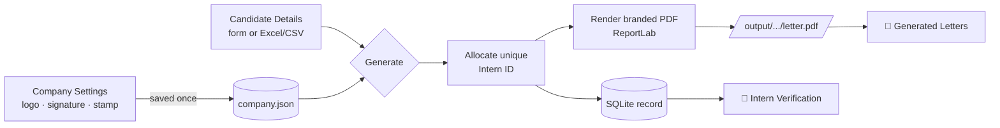
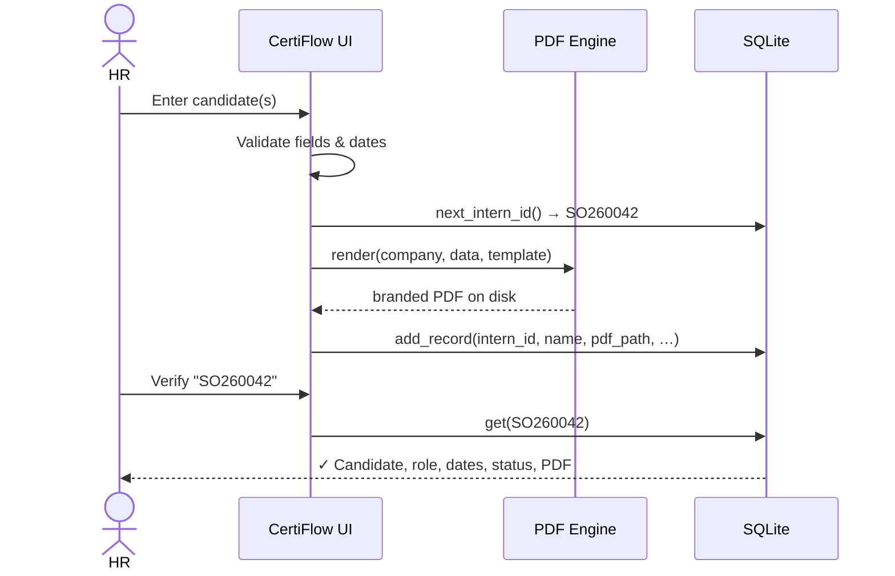
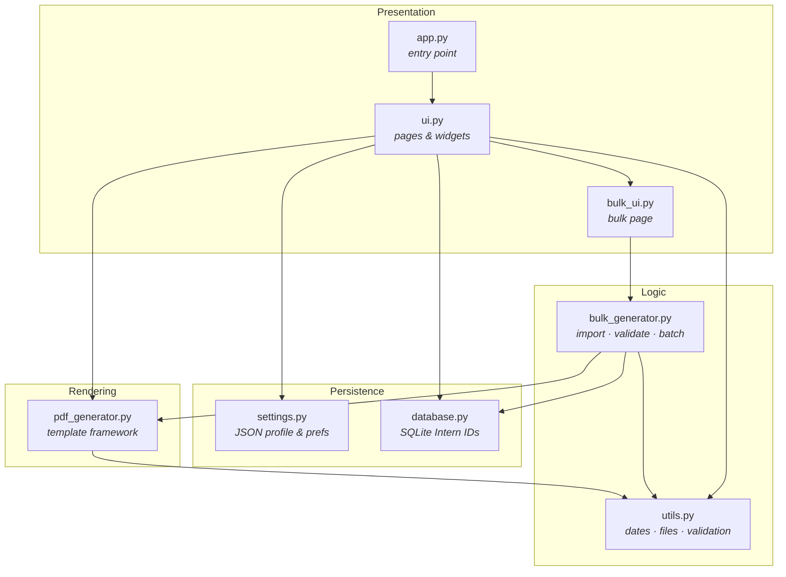

<div align="center">


# CertiFlow

### Professional Offer Letter &amp; Certificate Generator

*A polished, fully-offline desktop app that turns candidate details into beautiful, branded PDF documents in seconds.*

[](https://www.python.org/)
[](https://github.com/TomSchimansky/CustomTkinter)
[](https://www.reportlab.com/)
[](https://www.sqlite.org/)
[](#-installation)
[](#)

</div>

---

## ✨ Overview

**CertiFlow** is a desktop application for HR teams to generate professional, on-brand documents — offer letters, certificates, NDAs and more — without an internet connection. It pairs a clean, modern UI (inspired by Notion, Linear and Windows 11) with a print-quality PDF engine, an Excel/CSV bulk pipeline, and a built-in **Intern ID** system with offline verification.

> Set your company details once, and every document is generated with your logo, watermark, signature, auto-generated seal, consistent typography and a unique, verifiable Intern ID.

---

## 📑 Table of Contents

- [Features](#-features)
- [Preview](#-preview)
- [How It Works](#-how-it-works)
- [Architecture](#-architecture)
- [Tech Stack](#-tech-stack)
- [Installation](#-installation)
- [Usage](#-usage)
- [Document Templates](#-document-templates)
- [Intern ID System](#-intern-id-system)
- [Project Structure](#-project-structure)
- [Configuration](#-configuration)
- [Roadmap](#-roadmap)
- [Contributing](#-contributing)
- [License](#-license)

---

## 🚀 Features

| | Feature | Description |
|---|---|---|
| 📝 | **Single Letter Generator** | Fill a clean form and generate a polished PDF in under a minute. |
| ⚡ | **Bulk Generator** | Import an Excel/CSV **or type candidates manually**, then generate hundreds of letters at once on a background thread. |
| 🔎 | **Intern Verification** | Look up any issued document offline by its unique Intern ID (e.g. `SO260001`). |
| 🪪 | **Auto Intern IDs** | Gap-free, never-duplicated IDs that keep counting across restarts, stored in SQLite. |
| 🎨 | **Premium Branding** | Logo header, faint watermark, embedded signature, and an auto-generated circular company seal. |
| 🗂 | **9 Templates** | Offer letters, certificates, experience/relieving letters, NDA — all sharing one brand identity. |
| 🧮 | **Smart Dates** | Searchable position dropdown, duration → auto end-date (real month math), masked date input. |
| 🌓 | **Light / Dark Theme** | Remembered between sessions. |
| 📁 | **Document Library** | Search, sort, open, reveal-in-folder and delete every generated PDF (single **and** bulk). |
| 🧾 | **Audit Log** | Every generation is recorded in `logs/generation.log`. |
| 🔧 | **Configurable** | Footer color and signature font are selectable from the settings panel. |
| 🔌 | **100% Offline** | No servers, no accounts, no internet required. |

---

## 🖼 Preview

> The interface uses a sidebar layout with rounded cards, soft borders and a gold/black ScaleOn palette.

```text
┌───────────────────────────────────────────────────────────────────────┐
│  CertiFlow                                                              │
│ ───────────────                                                         │
│  📝 New Letter          ╭──────────────  Create a New Letter ─────────╮ │
│  ⚡ Bulk Generator      │  Document Template ▾     Duration ▾          │ │
│  🔎 Intern Verification │  Candidate Name [______]  Issue Date [__-__-__]│
│  🏢 Company Settings    │  Position ▾ (searchable)  Start Date [__-__-__]│
│  🗂 Templates           │  College  [______]        End Date  [auto] │ │
│  📁 Generated Letters   │  ⚡ Generate   👁 Preview   💾 Save   ↺ Reset │ │
│  ℹ  About               ╰───────────────────────────────────────────╯ │
│  ☀/🌙 Theme                                                            │
└───────────────────────────────────────────────────────────────────────┘
```

*(Add real screenshots to a `docs/` folder and embed them here once captured.)*

---

## 🔄 How It Works



**Single letter:** fill the form → CertiFlow allocates an Intern ID → renders the PDF → stores a record → opens the file.

**Bulk:** import a spreadsheet or add rows by hand → fix any highlighted invalid rows → **Generate All** runs in the background with live progress (ETA + cancel) → a completion report with *Open Folder / Export Report / Generate Again*.



---

## 🧱 Architecture

CertiFlow is built in clean, separated layers so new features slot in without refactoring.



| Module | Responsibility |
|---|---|
| `app.py` | Thin bootstrap — ensures folders exist, launches the UI. |
| `ui.py` | CustomTkinter window, navigation, all pages and shared widgets. |
| `bulk_ui.py` | Bulk Generator page: manual-entry form, editable table, progress window. |
| `pdf_generator.py` | ReportLab template framework — branding, seal, watermark, every document type. |
| `bulk_generator.py` | Excel/CSV import, validation, threaded batch generation, dated folders, logging. |
| `database.py` | SQLite layer for unique Intern IDs and verifiable records. |
| `settings.py` | Company profile + app preferences (JSON), asset auto-loading. |
| `utils.py` | Date math, filename de-duplication, validation, OS integration. |

---

## 🛠 Tech Stack

- **Python 3.11+**
- **CustomTkinter** — modern, themed UI
- **ReportLab** — vector, print-quality PDF generation (fonts embedded)
- **Pillow** — image processing (watermark, logo, signature)
- **tkcalendar** — date picker popups
- **openpyxl** — Excel import for bulk generation
- **SQLite** (stdlib) — Intern ID database
- **IBM Plex Sans** — bundled, embedded typeface

---

## 📦 Installation

> Requires **Python 3.11 or newer**.

```bash
# 1. Clone the repository
git clone https://github.com/amangovindrao/CertiFlow.git
cd CertiFlow

# 2. (Recommended) create a virtual environment
python -m venv .venv
# Windows
.venv\Scripts\activate
# macOS / Linux
source .venv/bin/activate

# 3. Install dependencies
pip install -r requirements.txt

# 4. Run the app
python app.py
```

On first launch you'll be guided to **Company Settings** — fill it in once and you're ready to generate.

---

## 📖 Usage

### 1) Company Settings (one time)
Open **🏢 Company Settings** and enter your company name, contact details and HR name. Upload your **logo, watermark, signature** and (optionally) a **stamp** — they're saved to `assets/` and auto-loaded on every launch. Choose your **footer text color** and **ScaleOn signature font**, then **Save**.

### 2) Generate a single letter
1. Go to **📝 New Letter**.
2. Pick a **template** and **duration**, type the **candidate name**, choose a **position** (searchable), and enter the **start date** (dashes are added automatically; the **end date** is calculated for you).
3. Click **⚡ Generate PDF** (or **👁 Preview** first). The PDF opens automatically and a unique **Intern ID** is assigned.

### 3) Generate in bulk
1. Go to **⚡ Bulk Generator**.
2. Either **📥 Import Excel / CSV** or use the **Add Candidate Manually** form to type entries one by one.
3. Review the table — invalid rows are highlighted; double-click any cell to edit; use **Select All** + **Delete** to manage rows.
4. Pick a template and click **⚡ Generate All** — watch live progress, then open the folder or export a report.

**Recognised spreadsheet columns** (case-insensitive, extras ignored):

```
Candidate Name | Position | Issue Date | Start Date | End Date
```

### 4) Verify a document
Open **🔎 Intern Verification**, type an Intern ID (e.g. `SO260015`) and click **Verify** to see the candidate, role, dates, status and linked PDF — fully offline.

### ⌨️ Keyboard Shortcuts

| Shortcut | Action |
|---|---|
| `Ctrl + G` | Generate PDF |
| `Ctrl + P` | Preview |
| `Ctrl + S` | Save As |
| `Ctrl + R` | Reset form |
| `Ctrl + 1…7` | Switch pages |

---

## 🗂 Document Templates

All templates inherit the same branding (header, watermark, signature, seal, footer, typography):

- Internship Offer
- Full-Time Offer
- Appointment Letter
- Internship Certificate
- Completion Certificate
- Experience Letter
- Relieving Letter
- Appreciation Certificate
- NDA

**Adding a template** is a one-class change in `pdf_generator.py`: subclass `BaseTemplate`, set a `title`, override `build_body()`, and register it in the `TEMPLATES` dict — it then appears automatically in the UI.

---

## 🪪 Intern ID System

Every generated document gets a unique ID in the format:

```
SO 26 0001
│  │  └── 4-digit auto-increment (per year)
│  └───── 2-digit year (2026)
└──────── company prefix
```

- **Never duplicated** — guarded against collisions.
- **Persistent** — the counter survives restarts (stored in SQLite).
- **Verifiable offline** — every ID maps to a full record (name, position, dates, duration, PDF path, status, timestamp).
- **Future-ready** — the schema is designed to support QR-code verification, an online portal, status tracking and completion-certificate linkage without refactoring.

---

## 🗃 Project Structure

```
CertiFlow/
├── assets/
│   ├── fonts/          # bundled IBM Plex Sans (embedded in PDFs)
│   ├── logo/           # company logo
│   ├── watermark/      # background watermark
│   ├── signature/      # HR signature (user-provided)
│   └── stamp/          # optional stamp image (else auto-generated)
├── company/            # company.json + app_settings.json + interns.db (runtime)
├── output/             # generated PDFs (bulk runs use dated sub-folders)
├── logs/               # generation.log
├── app.py              # entry point
├── ui.py               # main UI (pages + widgets)
├── bulk_ui.py          # bulk generator page
├── pdf_generator.py    # ReportLab template framework
├── bulk_generator.py   # import · validation · threaded generation
├── database.py         # SQLite Intern ID store
├── settings.py         # JSON persistence + asset auto-load
├── utils.py            # dates · filenames · validation · OS helpers
├── requirements.txt
└── README.md
```

> Runtime data (`company/*.json`, `interns.db`, generated PDFs, logs) is git-ignored. A `company/company.example.json` shows the expected profile shape.

---

## ⚙️ Configuration

Everything is controlled from **Company Settings** — no code changes needed:

- Company name, tagline, email, phone, website
- HR name
- Logo / Watermark / Signature / Stamp uploads (auto-loaded next launch)
- **Footer text color** (Black · Gold · Dark Gray · Blue)
- **ScaleOn signature font** (IBM Plex Sans · Arial · Serif · Helvetica)

Generated output is organised automatically:

```
output/2026-06-29/Offer Letters/Aman_Govind_Rao_Offer_Letter.pdf
output/2026-06-29/Certificates/...
```

Duplicate names never overwrite — they get `(1)`, `(2)`… suffixes.

---

## 🧭 Roadmap

- [ ] Email generated PDFs directly to candidates
- [ ] WhatsApp sharing
- [ ] QR-code verification printed on documents
- [ ] Online verification portal
- [ ] Multiple company profiles
- [ ] Employee database &amp; HR dashboard
- [ ] AI resume parser to auto-fill candidate details

---

## 🤝 Contributing

Contributions are welcome!

1. Fork the repo and create a feature branch: `git checkout -b feature/my-feature`
2. Commit your changes with clear messages.
3. Open a Pull Request describing what changed and why.

Please keep the layered architecture intact (UI → logic → persistence → rendering) and match the existing code style.

---

## 📄 License

Released under the **MIT License** — see [`LICENSE`](LICENSE).

The bundled **IBM Plex Sans** font is licensed under the SIL Open Font License 1.1.

---

<div align="center">

Built with ❤️ for HR teams · **CertiFlow** by [ScaleOn](https://github.com/amangovindrao)

*Scale Beyond Limits*

</div>
