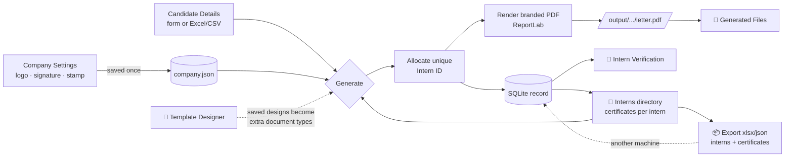
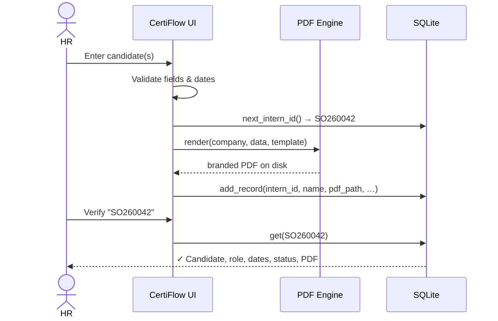
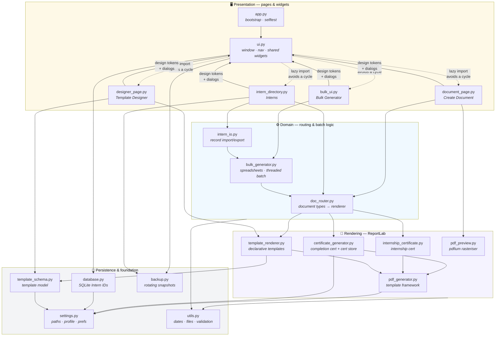
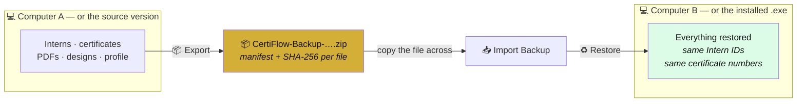
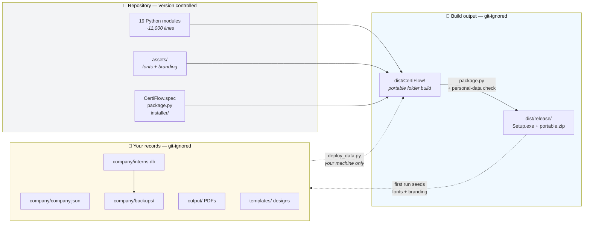

<div align="center">


# CertiFlow

### Professional Offer Letter &amp; Certificate Generator

*A polished, fully-offline desktop app that turns candidate details into beautiful, branded PDF documents in seconds.*

[](https://www.python.org/)
[](https://github.com/TomSchimansky/CustomTkinter)
[](https://www.reportlab.com/)
[](https://www.sqlite.org/)
[](#-installation)
[](#)
[](LICENSE)
[](https://github.com/amangovindrao/CertiFlow/releases)

[📥 Download](https://github.com/amangovindrao/CertiFlow/releases) · [📖 Documentation](docs/SETUP.md) · [🐛 Report Bug](https://github.com/amangovindrao/CertiFlow/issues) · [✨ Request Feature](https://github.com/amangovindrao/CertiFlow/issues)

</div>

---

## ✨ Overview

**CertiFlow** is a desktop application for HR teams to generate professional, on-brand documents — offer letters, certificates, NDAs and more — without an internet connection. It pairs a clean, modern UI (inspired by Notion, Linear and Windows 11) with a print-quality PDF engine, an Excel/CSV bulk pipeline, and a built-in **Intern ID** system with offline verification.

> Set your company details once, and every document is generated with your logo, watermark, signature, auto-generated seal, consistent typography and a unique, verifiable Intern ID.

---

## 🚀 Quick Start

### For End Users (No Python Needed)

1. **Download**: Get `CertiFlow-1.0.0-Setup.exe` from [Releases](https://github.com/amangovindrao/CertiFlow/releases)
2. **Install**: Run the installer (click "More info" → "Run anyway" if SmartScreen appears)
3. **Configure**: Fill in Company Settings on first launch
4. **Generate**: Create your first document from the 📄 Create Document page

### For Developers

```bash
git clone https://github.com/amangovindrao/CertiFlow.git
cd CertiFlow
python -m venv .venv && .venv\Scripts\activate  # Windows
pip install -r requirements.txt
python app.py
```

---

## 📑 Table of Contents

- [Quick Start](#-quick-start)
- [Features](#-features)
- [UI Preview](#-ui-preview)
- [How It Works](#-how-it-works)
- [Architecture](#-architecture)
- [Tech Stack](#-tech-stack)
- [Installation](#-installation)
  - [Pre-Built Executable](#option-1-pre-built-executable-recommended-for-end-users)
  - [Run from Source](#option-2-run-from-source-for-developers)
  - [First-Time Setup](#first-time-setup)
  - [System Requirements](#system-requirements)
  - [Troubleshooting](#troubleshooting-installation)
- [Building the Executable](#-building-a-windows-exe)
- [Usage](#-usage)
- [Document Types](#-document-types)
- [Intern ID System](#-intern-id-system)
- [Backup & Data Transfer](#-backup-restore-and-moving-between-computers)
- [Project Structure](#-project-structure)
- [Configuration](#-configuration)
- [Roadmap](#-roadmap)
- [License](#-license)
- [Contributing](#-contributing)

---

## 🚀 Features

| | Feature | Description |
|---|---|---|
| 📄 | **Create Document** | One page for every document type — offer letter, ongoing-internship certificate, completion certificate — with a **live preview** of the real PDF and PDF/PNG/JPG export. |
| 🎨 | **Template Designer** | Start from **any built-in document** (or a blank page) and build your own layout by **dragging elements on the page**. Saved designs become extra document types on Create Document, Bulk and Interns; the built-in documents are never touched. |
| 🎓 | **Internship Certificate** | A premium A4 **landscape** certificate for internships that are **ongoing or confirmed**. |
| 🏅 | **Certificate of Completion** | A separate premium A4 **landscape** certificate for internships that have finished. |
| 👥 | **Interns Directory** | Every intern on record with **how many certificates they have and which ones**, plus one-click generation of another — reusing their exact Intern ID. Interns can also be **deleted** (single or several at once). |
| 📦 | **Import / Export** | Move interns **together with their certificate records** to Excel, JSON or CSV and back. IDs and certificate numbers survive intact, existing records are never overwritten without asking, and a snapshot is taken first. |
| 💾 | **Backup & Restore** | One-click backup of **everything** — profile, database, certificates, designs, assets, generated PDFs — into a single portable file. Restore it on another computer, or after reinstalling, with **Merge** or **Replace**. Checksum-verified, so a corrupted archive is caught before it is applied. |
| ⚡ | **Bulk Generator** | Import Excel/CSV, **type candidates manually**, or **multi-select existing interns** from the database, then generate hundreds at once on a background thread. |
| 🪪 | **Smart Intern IDs** | Gap-free, never-duplicated IDs that **auto-match by name** — the same person keeps one ID across their offer letter and certificate. |
| 🔁 | **Generate Another** | From the document library, create a different document for any candidate, reusing their stored data and Intern ID. |
| 🔎 | **Intern Verification** | Look up any issued document offline by its unique Intern ID (e.g. `SO260001`). |
| 🎨 | **Premium Branding** | Logo header, faint watermark, embedded signature, and an auto-generated / uploadable company seal. |
| 🧮 | **Smart Dates** | Searchable position dropdown, duration → auto end-date (real month math), masked date input. |
| 🌓 | **Light / Dark Theme** | Remembered between sessions. |
| 📁 | **Document Library** | Search, sort, open, reveal-in-folder and delete every generated PDF (single **and** bulk, including dated sub-folders). |
| 🧾 | **Audit Log** | Every generation is recorded in `logs/generation.log`. |
| 🔧 | **Configurable** | Footer color and signature font are selectable from the settings panel. |
| 🔌 | **100% Offline** | No servers, no accounts, no internet required. |

---

## 🖼 UI Preview

### Main Interface

The interface uses a clean sidebar layout with rounded cards, soft shadows, and a professional gold/black ScaleOn palette. The UI adapts seamlessly between light and dark themes.

```text
┌──────────────────────────────────────────────────────────────────────────┐
│  CertiFlow                                                               │
│  ScaleOn                                                                 │
│ ───────────────                                                          │
│  📄 Create Document   ╭──────────────  Create Document ───────────────╮  │
│  🎨 Template Designer │  Document Type ▾                              │  │
│  👥 Interns           │  👥 Select Existing Intern      ┌───────────┐  │  │
│  ⚡ Bulk Generator    │  Intern Full Name [_________]  │   live    │  │  │
│  🔎 Verification      │  Internship Role ▾             │  preview  │  │  │
│  📁 Generated Files   │  Intern ID [SO260009]          │ (A4 ↔ / ↕)│  │  │
│  💾 Backup & Restore  │  Start [__-__-__] End [__-__-__└───────────┘  │  │
│  🏢 Company Settings  │  3-Month Internship • ONGOING                 │  │
│  ℹ  About             │  ⚡ Generate PDF  🖼 PNG  🖼 JPG  ↺ Reset     │  │
│                       ╰──────────────────────────────────────────────╯  │
│  ☀/🌙 Theme                                                              │
└──────────────────────────────────────────────────────────────────────────┘
```

### Key Screens

<details>
<summary>📄 <strong>Create Document Page</strong> — Generate any document with live preview</summary>

- Select document type (Offer Letter, Internship Certificate, Completion Certificate, or custom templates)
- Pick an existing intern or enter new details
- Auto-generated Intern ID with smart name matching
- Live A4 preview updates as you type
- Export as PDF, PNG, or JPG
- All fields validated in real-time

</details>

<details>
<summary>🎨 <strong>Template Designer</strong> — Build custom layouts visually</summary>

- Drag-and-drop canvas with real-time positioning
- Start from any built-in template or blank page
- Add text boxes, images, shapes, QR codes
- Precise control: font, size, color, alignment, rotation
- Saved designs become available document types
- Built-in templates are never modified

</details>

<details>
<summary>👥 <strong>Interns Directory</strong> — Manage all intern records</summary>

- Every intern with certificate count and types
- One-click generation of additional documents
- Multi-select delete with confirmation
- Search and filter by name, ID, domain
- Export selected records to Excel/CSV/JSON
- View full history per intern

</details>

<details>
<summary>⚡ <strong>Bulk Generator</strong> — Process hundreds at once</summary>

- Import from Excel/CSV with validation
- Type candidates directly in the built-in table
- Multi-select from existing interns
- Background generation with progress bar
- Auto-creates dated folders (e.g., `output/2026-08-30/`)
- Automatic ZIP of completed batch

</details>

<details>
<summary>💾 <strong>Backup & Restore</strong> — Complete data migration</summary>

- One-click export of entire application state
- Shows what's on this machine vs. what's in each backup
- Import backup from any location
- Merge or Replace restore modes
- Integrity verification (SHA-256 per file)
- Exclude PDFs for smaller archives

</details>

<details>
<summary>🔎 <strong>Verification Page</strong> — Look up any issued document</summary>

- Search by Intern ID (e.g., SO260001)
- Displays full candidate details
- Shows all issued certificates
- Links to original PDF files
- Works 100% offline

</details>

<details>
<summary>📁 <strong>Generated Files</strong> — Document library</summary>

- All PDFs with search and date filtering
- Sort by name, date, size, or type
- Open PDF, reveal in folder, or delete
- Handles both single documents and bulk folders
- Shows file count and total storage used

</details>

<details>
<summary>🏢 <strong>Company Settings</strong> — Configure branding</summary>

- Company name, HR details, footer text
- Upload logo, signature, stamp, watermark
- Choose footer color and signature font
- Preview updates instantly
- Settings persist across sessions

</details>

---

## 🔄 How It Works



**Single letter:** fill the form → CertiFlow allocates an Intern ID → renders the PDF → stores a record → opens the file.

**Bulk:** import a spreadsheet, add rows by hand, or multi-select existing candidates (keeping their Intern IDs) → fix any highlighted invalid rows → **Generate All** runs in the background with live progress (ETA + cancel) → a completion report with *Open Folder / Export Report / Generate Again*.

**Internship Certificate:** enter intern-only details → the live preview rasterises the real PDF as you type → export PDF/PNG/JPG with a `SO-INT-26XXXX` number recorded for offline verification.



---

## 🧱 Architecture

19 internal modules, ~11,000 lines, in clean layers so new features slot in without refactoring. Nothing in a lower layer imports from a higher one.



**Reading the graph.** `utils.py` and `settings.py` are the foundation — imported by 13 and 9 modules and importing nothing internal themselves. `doc_router.py` is the single choke point for "which renderer handles this document type", which is why adding the Template Designer needed no changes to any existing renderer.

The one deliberate wrinkle: `ui.py` imports the four page modules **lazily inside methods**, while those pages import `ui` at module level for shared design tokens and dialogs. That breaks what would otherwise be a circular import, and keeps every page's styling in one place.

| Module | Responsibility |
|---|---|
| `app.py` | Thin bootstrap — ensures folders exist, launches the UI. |
| `ui.py` | CustomTkinter window, navigation, shared widgets and the remaining pages. |
| `document_page.py` | Create Document page: every document type, live preview, PDF/PNG/JPG export. |
| `bulk_ui.py` | Bulk Generator page: manual-entry form, editable table, progress window. |
| `intern_directory.py` | Intern aggregation (interns × their certificates), the shared intern picker, and the Interns page. |
| `intern_io.py` | Import/export of existing records (interns + certificates) as xlsx/json/csv, with a preview-then-apply merge. |
| `data_transfer.py` | Full backup, restore and migration: one portable `.zip` of the entire application state, checksum-verified. |
| `backup_page.py` | Backup & Restore page: export, import, restore, and the backup folder. |
| `pdf_generator.py` | ReportLab template framework — branding, seal, watermark, portrait documents. |
| `certificate_generator.py` | Premium A4 **landscape** Certificate of Completion + the shared certificate-number store. |
| `internship_certificate.py` | Premium A4 **landscape** Internship Certificate for ongoing/confirmed internships. |
| `pdf_preview.py` | Rasterises the PDF for the live preview and PNG/JPG export. |
| `designer_page.py` | Template Designer: the drag-and-drop canvas editor. |
| `template_schema.py` | Declarative template model (elements, placeholders, JSON storage). |
| `template_renderer.py` | Renders a declarative template to a PDF. |
| `doc_router.py` | Single source of truth for document types; routes each to the right renderer + file name. |
| `bulk_generator.py` | Excel/CSV import, validation, threaded batch generation, dated folders, logging. |
| `database.py` | SQLite layer for unique Intern IDs, name lookup, verifiable records and deletion. |
| `settings.py` | Company profile + app preferences (JSON), asset auto-loading, stored-path normalisation. |
| `backup.py` | Rotating database snapshots taken before every destructive action. |
| `utils.py` | Date math, filename de-duplication, validation, OS integration. |

---

## 🛠 Tech Stack

- **Python 3.11+**
- **CustomTkinter** — modern, themed UI
- **ReportLab** — vector, print-quality PDF generation (fonts embedded)
- **Pillow** — image processing (watermark, logo, signature)
- **tkcalendar** — date picker popups
- **openpyxl** — Excel import for bulk generation
- **pypdfium2** — renders the PDF for the live certificate preview and PNG/JPG export (optional; PDF generation works without it)
- **SQLite** (stdlib) — Intern ID database
- **IBM Plex Sans** — bundled, embedded typeface. Certificates add a display face (Montserrat/Poppins → Segoe UI) and an elegant serif for the intern name (Playfair Display/Cormorant → Georgia/Cambria), resolved from `assets/fonts/` or the OS — never downloaded

---

## 📦 Installation

### Option 1: Pre-Built Executable (Recommended for End Users)

**No Python required. Just download and run.**

#### Windows Installation

1. **Download the installer**
   - Go to [Releases](https://github.com/amangovindrao/CertiFlow/releases)
   - Download `CertiFlow-1.0.0-Setup.exe` (~28 MB)

2. **Run the installer**
   - Double-click the downloaded file
   - **Windows SmartScreen warning?** Click "More info" → "Run anyway"
     - This appears because the .exe is not code-signed (costs $400+/year)
     - The app is 100% safe and open-source
   
3. **Choose install location**
   - **Default (recommended)**: `%LOCALAPPDATA%\CertiFlow\` (no admin rights needed)
   - **Custom**: Pick any folder you have write access to
   
4. **Launch CertiFlow**
   - From Start Menu: search "CertiFlow"
   - Or double-click the desktop icon if you chose to create one

#### Portable Version (No Installation)

Perfect for USB drives or if you don't want to install anything:

1. Download `CertiFlow-1.0.0-portable.zip` (~37 MB)
2. Unzip to any folder
3. Run `CertiFlow.exe`
4. Everything stays in that folder — no registry entries, no AppData

### Option 2: Run from Source (For Developers)

> Requires **Python 3.11 or newer**. Works on Windows, macOS, and Linux.

```bash
# 1. Clone the repository
git clone https://github.com/amangovindrao/CertiFlow.git
cd CertiFlow

# 2. (Recommended) create a virtual environment
python -m venv .venv

# Activate it:
# Windows (PowerShell/CMD)
.venv\Scripts\activate
# macOS / Linux
source .venv/bin/activate

# 3. Install dependencies
pip install -r requirements.txt

# 4. Run the app
python app.py
```

On first launch you'll be prompted to complete **Company Settings** — fill it in once and you're ready to generate documents.

### First-Time Setup

When you launch CertiFlow for the first time:

1. **Company Settings prompt appears**
   - Click "Configure Now" to open Company Settings
   
2. **Fill in your organization details:**
   - Company Name (appears on all documents)
   - HR Name and Designation
   - Contact email and phone
   - Office address
   
3. **Upload your branding (optional but recommended):**
   - **Logo**: Company logo for document header (PNG/JPG)
   - **Signature**: HR signature image (PNG/JPG)
   - **Stamp**: Company seal/stamp (PNG with transparency)
   - **Watermark**: Background watermark (PNG with transparency)
   
4. **Click "Save Settings"**

You're all set! Now you can generate documents from any page.

### System Requirements

| Component | Minimum | Recommended |
|---|---|---|
| **OS** | Windows 10, macOS 10.15, or Linux | Windows 11, macOS 12+, or recent Ubuntu/Fedora |
| **RAM** | 2 GB | 4 GB or more |
| **Storage** | 150 MB for app + 500 MB for data | 1 GB or more for generated documents |
| **Display** | 1366 × 768 | 1920 × 1080 or higher |
| **Python** | 3.11+ (source only) | 3.11 or 3.12 |

### Troubleshooting Installation

<details>
<summary><strong>Windows SmartScreen blocks the installer</strong></summary>

This happens because the .exe is not code-signed (signing certificates cost $400+/year and we're an open-source project).

**To proceed safely:**
1. Click "More info"
2. Click "Run anyway"
3. The app is completely safe and all code is public on GitHub

Alternatively, use the portable version (no SmartScreen warning) or run from source.

</details>

<details>
<summary><strong>"Python was not found" when running from source</strong></summary>

**Windows:**
- Download from [python.org](https://www.python.org/downloads/)
- During installation, check "Add Python to PATH"
- Restart your terminal after installing

**macOS:**
```bash
brew install python@3.11
```

**Linux:**
```bash
sudo apt install python3.11 python3.11-venv  # Ubuntu/Debian
sudo dnf install python3.11  # Fedora
```

</details>

<details>
<summary><strong>pip install fails with "externally-managed-environment"</strong></summary>

You're on Linux with system-managed Python. Use a virtual environment:

```bash
python3 -m venv .venv
source .venv/bin/activate
pip install -r requirements.txt
```

</details>

<details>
<summary><strong>App opens but shows "Failed to register fonts"</strong></summary>

The font files are missing from `assets/fonts/`. This shouldn't happen in a proper install, but if it does:

1. **From source**: make sure you cloned the full repo with `git clone`
2. **Portable build**: make sure you extracted the entire ZIP, not just the .exe
3. **Installed version**: try reinstalling

</details>

<details>
<summary><strong>Generated PDFs show squares instead of text</strong></summary>

Font embedding failed. Check that all `.ttf` files exist in:
- Source: `assets/fonts/`
- Installed: `%LOCALAPPDATA%\CertiFlow\assets\fonts\`
- Portable: `<unzip_folder>\assets\fonts\`

If missing, reinstall or re-clone.

</details>

---

## 🏗 Building a Windows .exe

> Summary below. **[docs/SETUP.md](docs/SETUP.md)** has the full guide: every step with the reasoning behind it, diagrams of the build pipeline and data-location logic, silent-install switches, a release checklist and a troubleshooting section.

For machines without Python. One command produces both shareable artefacts:

```powershell
pip install -r requirements.txt -r requirements-build.txt
python tools/package.py
```

Output lands in `dist\release\`:

| Artefact | Size | For |
|---|---|---|
| `CertiFlow-1.0.0-Setup.exe` | ~28 MB | Normal installation. **No administrator rights needed.** Start Menu entry, optional desktop icon, listed in Apps & Features, clean uninstaller. |
| `CertiFlow-1.0.0-portable.zip` | ~37 MB | Unzip and run. Nothing installed, everything stays in the folder — good for a USB stick. |

Both are safe to hand to someone else: `package.py` **refuses to build** if the intern database or any generated PDF made it into the payload, so a folder you previously filled with real records via `deploy_data.py` cannot be packaged by accident.

Useful variations:

```powershell
python tools/package.py --skip-build      # reuse dist\CertiFlow as it stands
python tools/package.py --no-installer    # portable ZIP only
python -m PyInstaller --noconfirm --clean CertiFlow.spec   # plain folder build
```

The plain folder build at `dist\CertiFlow\` is a portable copy — handy during development, and what `deploy_data.py` targets by default.

Building the installer needs [Inno Setup 6](https://jrsoftware.org/isdl.php) (free). `package.py` finds it automatically in `%LOCALAPPDATA%\Programs\InnoSetup6` or Program Files, and skips the installer step with a note if it is missing. Inno Setup installs per-user without admin rights: `innosetup-x.y.z.exe /VERYSILENT /CURRENTUSER`.

**Verify a build before shipping it:**

```powershell
CertiFlow.exe --selftest
```

This generates one of every document type, checks the bundled fonts and branding loaded, confirms the pdfium preview works, opens the database and round-trips an import/export in all three formats, then writes a report to the data folder's `logs\selftest.log`. Exit code `0` means the build is good.

### Where your data lives

CertiFlow keeps the program and your data apart, and picks the data location from how the copy was obtained:

| Copy | Data folder | Why |
|---|---|---|
| **Installed** | `%LOCALAPPDATA%\CertiFlow` | Always writable even under Program Files, private to each Windows user, and untouched by upgrades or uninstalls. |
| **Portable** | beside `CertiFlow.exe` | The whole folder is the backup — copy it and your records travel with it. |
| **Any** | `CERTIFLOW_DATA=D:\some\path` | Overrides both, e.g. a shared network folder. |

The switch is a single file, `installed.marker`, which the installer places next to the .exe and a portable build does not have. The **About** page always shows the current mode and the exact path, with buttons to open or copy it — that's the folder to back up.

Either way the data folder holds `company\` (profile + intern database), `output\` (generated PDFs), `templates\` (saved designs), `assets\` (your logo, signature, stamp, watermark) and `logs\`. On first run it is seeded from a read-only copy inside the build, and seeding only ever *adds* missing files, so upgrading never overwrites your logo or company profile.

**Uninstalling keeps your data.** The uninstaller asks before deleting `%LOCALAPPDATA%\CertiFlow` and defaults to *No*, so a stray uninstall cannot destroy a company's certificate records. Reinstalling picks the data up again.

### Where the data lives

The build separates the program from your data:

| | Location | Contents |
|---|---|---|
| **Program** | `CertiFlow.exe` + `_internal\` | Code, Python runtime, libraries. Replace these to upgrade. |
| **Your data** | `company\`, `output\`, `templates\`, `assets\`, `logs\` — beside the .exe | Company profile, intern database, generated PDFs, saved designs, uploaded logo/signature. |

On first run the app seeds `assets\` (fonts and branding) and `company\company.json` from a read-only copy inside `_internal\_bundled\`. It only ever *adds* missing files, so **upgrading the exe never overwrites your logo or company profile**. Back up by copying the data folders.

> **Your intern database is never included in a build.** `company\interns.db` holds personal data, so it is deliberately left out — a fresh install or unzip starts with an empty database. That is what makes the artefacts shareable.

### Deploying your own data into a build

For a build you're using yourself rather than sharing:

```powershell
python tools/deploy_data.py                  # fills dist\CertiFlow
python tools/deploy_data.py "D:\CertiFlow"   # or any other build folder
```

This copies the intern database (via SQLite's online backup API, so the copy is consistent even under WAL), the company profile and preferences, your saved designs, the assets, and the generated PDFs in `output\` — the last one matters because stored PDF paths are project-relative, so without it the *Open PDF* buttons cannot find past documents.

Re-run it after every rebuild: `--clean` deletes the whole `dist\CertiFlow` folder, data included.

> After running it the folder contains intern personal data. To hand the build to someone else, delete `company\interns.db` and `output\` from the copy, or just rebuild without deploying.

### Notes

- **One folder, not one file.** A `--onefile` exe re-extracts ~85 MB into a temp folder on every launch. The folder build starts instantly; the installer and ZIP wrap it into a single file to hand over, which is the part that actually matters for sharing.
- **Windows only.** PyInstaller does not cross-compile; build on the OS you're targeting.
- **Diagnosing a failed launch.** A windowed build shows no traceback, so startup errors are written to `logs\crash.log` in the data folder. For live output, build a console variant: `$env:CERTIFLOW_CONSOLE=1; python -m PyInstaller --noconfirm CertiFlow.spec`. Never ship that variant.
- **Icon.** `assets\app.ico` is generated from the square ScaleOn mark by `python tools/build_icon.py`. Re-run it only when the branding changes.
- **Version number** lives in one place, `settings.APP_VERSION`. The About page, the exe, the installer and the artefact filenames all read from it.
- **Stop the app before rebuilding.** `--clean` deletes `dist\CertiFlow`, which fails with *Access is denied* if a copy is still running from that folder.
- **Antivirus / SmartScreen.** Unsigned installers commonly trigger a "Windows protected your PC" warning on other machines — recipients must click *More info → Run anyway*. A code-signing certificate is the only real fix, and is worth it if you distribute this widely.

---

## 📖 Usage

### 1) Company Settings (one time)
Open **🏢 Company Settings** and enter your company name, contact details and HR name. Upload your **logo, watermark, signature** and (optionally) a **stamp** — they're saved to `assets/` and auto-loaded on every launch. Choose your **footer text color** and **ScaleOn signature font**, then **Save**.

### 2) Create a document
1. Go to **📄 Create Document**.
2. Pick the **document type**. Fields follow the type: *Program Name* appears for the internship certificate, *Grade* and *Remarks* for the completion certificate, neither for an offer letter.
3. Click **👥 Select Existing Intern** to pull someone already on record — their **Intern ID**, role and dates fill in automatically, and you're told which certificates they already have. Or type the details: **full name, role, Intern ID, start/end dates and issue date**, plus optional **department**. No company fields: the logo, tagline, watermark, seal and HR signature block come from Company Settings.
4. The **live preview** on the right updates as you type, rendered from the very same PDF that gets exported — portrait for letters, landscape for certificates — along with the calculated duration (real calendar months) and the `INTERNSHIP ONGOING` status.
5. Export as **PDF**, **PNG** or **JPG**. Images are rendered from the PDF at 300 dpi (3508 × 2481) and never below **2.5K** on the long edge, whatever dpi is requested. If the issue date is on or after the end date, CertiFlow offers to generate the Certificate of Completion instead — it never switches type on its own.

### 3) Design your own template (optional)
1. Go to **🎨 Template Designer**.
2. Pick a starting point from **New from…** — *Internship Offer*, *Internship Certificate*, *Completion Certificate* or *Blank page*. Copying a built-in document opens it as movable elements (logo, borders, title, name, body copy, badge, signature block, seal, footer) on the original's page size: portrait for the offer letter, landscape for the certificates. The **page size** menu next to it can be changed at any time.
3. **Drag anything** on the page to move it. Click to select (in the canvas or the list on the left), arrow keys nudge by 1 pt, `Shift` + arrows by 10, `Delete` removes, `Ctrl+Z` undoes. Centred elements **snap to the page centre** with a guide line.
4. The **Properties** panel on the right edits the selected element: text, font, size, colour (with a picker), alignment, letter spacing, wrap width, line height, size and position — plus **Centre**, **Duplicate**, **Bring forward** and **Send back**.
5. Add elements with **Text**, **Field**, **Image**, **Line**, **Box** and **Badge**. A *Field* pulls live data — Intern name, Intern ID, Certificate no, Role, Program, dates, Duration, Status, Grade, Remarks, Company name, Tagline, HR name. Any text may contain `{placeholders}` too.
6. **👁 Preview PDF** renders the design with sample data so you can check it as a real page. **💾 Save** stores it under its name, **Save As** copies it under a new one, and **🗑** deletes it. The menu on the far left reopens any saved design.

Once saved, the design appears as an extra **document type** on the Create Document, Bulk Generator and Interns pages and generates like any other document. It renders through its own engine, so **nothing you do here can affect the built-in documents** — and with no saved designs the type lists are exactly as they were. Templates are plain JSON in `templates/`.

> Custom designs are layouts, not certificates: they don't allocate certificate numbers. Use the built-in certificate types when you need a verifiable number.

### 4) Browse interns and their certificates
1. Go to **👥 Interns**.
2. The stats strip shows how many interns exist and how many certificates have been issued, split by type. Search by name, Intern ID or role, filter by **With / Without certificates**, and **sort** by name (A–Z / Z–A), joining date, end date, Intern ID, certificate count, role or recently added. Clicking a column header sorts by it and toggles direction.
3. Select an intern to see their details and **every certificate already issued to them** — number, type, issue date, status, and an **Open** button for each PDF.
4. Pick a document type and click **⚡ Generate** to issue another for that intern. Their **exact Intern ID** and saved dates are reused, so two interns who share a name never get mixed up.
5. **⚡ Bulk Certificates** sends the interns currently shown (respecting your search/filter) straight to the Bulk Generator, ready to generate for all of them.
6. **📤 Export** and **📥 Import** move records in and out — see [below](#-importing-and-exporting-records).
7. **🗑 Delete** removes intern records. Select one, or Ctrl/Shift-click several — the button shows how many will go. You're asked to confirm and given two options when certificates are linked:
   - **Delete + N Certificate(s)** — removes the intern and their certificate records. Any certificate number already handed out will stop verifying.
   - **Delete Intern Only** — keeps the certificate records, so issued numbers still verify. Those certificates are then flagged under the list as *not linked to a listed intern*.

   Generated **PDF files on disk are never deleted** by this (use 📁 Generated Files for that), and a deleted Intern ID is never reissued to someone else.
8. **🧹 Remove N Duplicates** cleans up people who ended up with more than one record, in one click. The **lowest Intern ID** (the one assigned first) is kept and the extra copies are removed; you see exactly which IDs are kept and dropped before confirming. Certificates are **not** deleted — they stay verifiable and re-attach to the surviving record, so certificate history is never lost. The button is disabled when there is nothing to clean.
9. **✎ next to the Intern ID** corrects a wrong ID. It moves the record, repoints every certificate, and optionally **re-creates the certificate PDFs keeping their original certificate numbers**, so a document already handed out ends up printing the right ID. A taken ID is refused by name, and a hand-set ID is never reissued by the allocator. 📋 buttons copy any Intern ID or certificate number.

### 📦 Importing and exporting records

Interns and **the certificates issued to them** travel together, so a set of records can be moved to another machine, handed to a colleague, or kept as a readable backup alongside the database snapshots.

**Export** (**📤 Export** on the Interns page) writes whatever the list is currently showing, so a search or filter doubles as a way to export a subset. Ctrl/Shift-click **two or more** interns to export just those; a single click selects a row for viewing and still exports the full filtered list.

| Format | Contents |
|---|---|
| **`.xlsx`** *(recommended)* | Two sheets — `Interns` and `Certificates`. Full round-trip, opens in Excel. |
| **`.json`** | `{"interns": [...], "certificates": [...]}`. Full round-trip, easy to diff or script. |
| **`.csv`** | Interns **only** — a flat file cannot hold two tables. You're warned before any certificate history would be dropped. |

**Import** (**📥 Import**) reads any of those three back, and also accepts a hand-made spreadsheet. Nothing is written until you've seen what will happen:

1. The file is parsed and every row validated. Rows missing an Intern ID or a name are listed as skipped, with the reason.
2. A summary tells you how many records are **new**, how many are **already on record**, and how many certificates point at an Intern ID that isn't present.
3. You choose **Add N New Only** (existing records untouched) or **Add + Overwrite N**. There is no silent overwrite.
4. A **database snapshot is taken first**, so an import can be rolled back from `company/backups/`.

Imported interns are ordinary records — the import summary offers **Generate Certificates** to send them straight to the Bulk Generator, or you can issue documents individually from the list as usual.

Details worth knowing:

- **IDs are preserved exactly.** Imported Intern IDs and certificate numbers come across as-is, and both allocators are advanced past them, so an imported ID is never later handed to a different person.
- **Re-importing the same file changes nothing** when you pick *Add New Only*, and updates in place (never duplicates) when you pick *Overwrite*.
- **Column headers are matched case-insensitively with aliases**, so `Name`, `Role`, `Dept`, `Joining Date` and `ID` all work. Dates in `YYYY-MM-DD`, `DD/MM/YYYY` and several other layouts are normalised to `DD-MM-YYYY`.
- **A hand-made sheet needs only `Intern ID` and `Candidate Name`** per row; everything else is optional. Export a file first to see every column.
- **Certificates whose intern is missing still import** and stay verifiable by number — they're just listed as not linked to any intern.
- **PDF file paths are carried across but files are not.** Importing on another machine restores the records; the *Open* buttons only work where the PDFs actually exist.

### 💾 Backup, restore and moving between computers

**📦 Export / Create Backup** writes your **entire** installation into one file: company profile, preferences, the intern database with every certificate record, saved designs, branding assets, and every generated PDF. It lands in a `Backup & Restore` folder inside your data folder.

That single file is all you need to move to the packaged .exe, survive a reinstall, or set up another computer.



| Button | What it does |
|---|---|
| **📦 Export / Create Backup** | Archives everything into a timestamped `.zip`. Untick *Include generated PDFs* for a much smaller records-only backup. |
| **📥 Import Backup** | Browse to a backup from anywhere — a USB stick, email, another PC — copies it into your backup folder and offers to restore it. |
| **♻ Restore Data** | Restores the backup selected in the list. Double-clicking a row does the same. |
| **📂 Open Backup Folder** | Opens the folder in Explorer so you can copy, move or archive the files yourself. |

**Restoring asks how to handle what's already here:**

- **Merge** *(recommended on a machine with data)* — adds only what's missing and leaves everything you have alone. Intern IDs and certificate numbers are preserved, so nothing is ever duplicated and issued certificates keep verifying.
- **Replace** — discards the current data and restores the backup as-is. Needs a restart, because the database file itself is swapped.

On a **fresh install** there's nothing to lose, so it just restores everything in one click.

Details worth knowing:

- **Your database is snapshotted before every restore**, into `company/backups/`, so a restore can be undone.
- **Integrity is checked first.** Every file is recorded in `manifest.json` with a SHA-256, and the archive is re-verified before anything is applied — a truncated or edited backup is refused rather than half-restored.
- **Merge never overwrites your company profile.** If you already have one set up, the backup's branding is deliberately left out and you're told so.
- **Backups don't nest.** The backup folder, logs and database snapshots are excluded, so backing up repeatedly doesn't grow each file by the size of the last one.
- **Re-restoring the same backup changes nothing** in Merge mode.
- **Verified with real data:** a 39 MB export of 17 interns, 65 certificates and 112 PDFs restored into a fresh install with identical Intern ID sets, identical certificate numbers, both ID counters intact, and all 65 stored PDF paths resolving.

### No duplicates going forward

CertiFlow now actively prevents the duplicates it used to allow:

- **One Intern ID per person.** Name matching ignores case and spacing, so `"  aakif   JAWAID "` resolves to the existing `Aakif Jawaid`. If you try to generate for a name already on record under a different ID, you're asked whether to use the existing record or deliberately create a new one.
- **One certificate of each type per intern.** Issuing a second Internship Certificate (or Completion Certificate) to the same intern warns you first, showing the number and date of the one they already have.
- **No repeats inside a bulk run.** Rows that resolve to the same person are collapsed, and interns who already hold that certificate are listed so you can generate only the new ones.
- Intern records keep their original `created_at` instead of resetting it on every update, so the audit trail and "recently added" ordering stay meaningful.

### 5) Generate in bulk
1. Go to **⚡ Bulk Generator**.
2. **📥 Import** an Excel/CSV, use the **Add Candidate Manually** form, or click **👥 Select Existing** to pick **several interns** from a searchable, multi-select list showing how many certificates each already has (with a *Without certificates only* toggle) — each arrives with their **existing Intern ID** and saved details filled in. Not sure of the columns? **📄 Sample File** writes a starter `.xlsx`/`.csv` with exactly the headers the importer reads.
3. Review the table — invalid rows are highlighted **and the `Issues` column says what is wrong with each one**. Double-click any cell to edit; `Ctrl+A` selects every row and `Delete` removes the selection. **Intern ID** and **Issues** are read-only.
4. Pick a **document type** and click **⚡ Generate All** — watch live progress, then open the folder, **zip the whole batch** for handover, or export a report (which includes Intern IDs and certificate numbers). If some rows have problems you can **generate the valid ones now** and fix the rest afterwards.

**Recognised spreadsheet columns** (case-insensitive, extras ignored):

```
Candidate Name | Position | Department | Issue Date | Start Date | End Date | Intern ID
```

### 6) Browse generated files
**📁 Generated Files** lists every PDF under `output/` (including bulk sub-folders) with search, sorting, and Open / Reveal / Delete per file. To issue another document for someone, use **👥 Interns** — it matches on the Intern ID rather than guessing a name from a file name.

### 7) Verify a document
Open **🔎 Intern Verification** and type either an **Intern ID** (e.g. `SO260015`) or a **certificate number** (e.g. `SO-INT-260031` or `SO-CERT-260001`), then click **Verify**. You'll see the candidate, certificate type, role, dates, status and linked PDF — fully offline. Formatting is forgiving: lowercase, missing dashes or just the digits all resolve. Verifying by Intern ID also lists any certificate numbers issued to that person.

### ⌨️ Keyboard Shortcuts

| Shortcut | Action |
|---|---|
| `Ctrl + G` | Generate the current document |
| `Ctrl + R` | Reset the form |
| `Ctrl + 1…9` | Switch pages |

---

## 🗂 Document Types

The document dropdown is curated to the types used in practice — all sharing the
same ScaleOn branding (header, watermark, signature, seal, footer, typography):

- **Internship Offer** — portrait offer letter with the approved body text.
- **Internship Certificate** — premium **A4 landscape** certificate for an internship that is **currently ongoing or officially confirmed**. Never uses completion wording; shows an `INTERNSHIP ONGOING` status and a `SO-INT-26XXXX` certificate number.
- **Completion Certificate** — premium **A4 landscape** Certificate of Completion for a *finished* internship, with optional grade/remarks and a `SO-CERT-26XXXX` number.

> The older portrait "Internship Completion Certificate" was removed — it duplicated the Certificate of Completion.

**Adding a type** is a small change: portrait documents subclass `BaseTemplate`
in `pdf_generator.py`; the landscape certificate lives in
`certificate_generator.py`. The `doc_router.py` module maps a document type to
the right renderer and file name, keeping the single and bulk flows in sync.

---

## 🪪 Intern ID System

Every generated document gets a unique ID in the format:

```
SO 26 0001
│  │  └── 4-digit auto-increment (per year)
│  └───── 2-digit year (2026)
└──────── company prefix
```

Certificates additionally carry their own number, on a **separate sequence per
certificate family**, printed on the document and verifiable offline:

```
SO-INT-260031     Internship Certificate  (ongoing / confirmed)
SO-CERT-260031    Certificate of Completion (finished)
```

- **Never duplicated** — guarded against collisions.
- **Persistent** — the counter survives restarts (stored in SQLite).
- **Verifiable offline** — every ID maps to a full record (name, position, dates, duration, PDF path, status, timestamp).
- **Future-ready** — the schema is designed to support QR-code verification, an online portal, status tracking and completion-certificate linkage without refactoring.

---

## 🗃 Project Structure

Application code sits at the root; everything that is *not* shipped inside the app — build tooling, docs, installer — lives in its own folder.

```
CertiFlow/
│
├── app.py                      # entry point · --selftest · crash handler
│
├── ── UI pages ───────────────────────────────────────────────────
├── ui.py                       # window · navigation · shared widgets · dialogs
├── document_page.py            # 📄 Create Document (live preview)
├── designer_page.py            # 🎨 Template Designer (drag-and-drop canvas)
├── intern_directory.py         # 👥 Interns (+ shared intern picker)
├── bulk_ui.py                  # ⚡ Bulk Generator
├── backup_page.py              # 💾 Backup & Restore
│
├── ── Domain logic ───────────────────────────────────────────────
├── doc_router.py               # document type -> renderer + file name
├── bulk_generator.py           # spreadsheets · validation · threaded batch
├── intern_io.py                # import/export interns + their certificates
├── data_transfer.py            # full backup / restore / migration archives
│
├── ── Rendering ──────────────────────────────────────────────────
├── pdf_generator.py            # ReportLab framework (portrait documents)
├── certificate_generator.py    # A4 landscape completion cert + cert store
├── internship_certificate.py   # A4 landscape internship certificate
├── template_renderer.py        # renders declarative designer templates
├── pdf_preview.py              # pdfium rasteriser for previews / PNG · JPG
│
├── ── Persistence & foundation ───────────────────────────────────
├── settings.py                 # paths · data-location logic · JSON · seeding
├── database.py                 # SQLite Intern IDs · records · lookup
├── template_schema.py          # declarative template model + JSON storage
├── backup.py                   # rotating pre-action database snapshots
├── utils.py                    # dates · filenames · validation · OS helpers
│
├── ── Packaging ──────────────────────────────────────────────────
├── CertiFlow.spec              # PyInstaller recipe
├── installer/
│   ├── CertiFlow.iss           # Inno Setup script
│   └── installed.marker        # switches an installed copy to %LOCALAPPDATA%
├── tools/                      # dev-only, never shipped inside the app
│   ├── package.py              # build → personal-data check → ZIP + installer
│   ├── deploy_data.py          # copy live data into a built folder
│   └── build_icon.py           # generate assets/app.ico
│
├── ── Assets (shipped) ───────────────────────────────────────────
├── assets/
│   ├── fonts/                  # bundled IBM Plex Sans (embedded in PDFs)
│   ├── logo/  watermark/       # branding
│   ├── signature/  stamp/      # HR signature · optional stamp
│   └── app.ico                 # Windows icon
│
├── ── Runtime data (git-ignored) ─────────────────────────────────
├── company/                    # company.json · app_settings.json · interns.db
│   └── backups/                # automatic database snapshots
├── templates/                  # designs saved in the Template Designer
├── output/                     # generated PDFs (bulk runs use dated folders)
├── logs/                       # generation · selftest · crash
├── Backup & Restore/           # your exported backup archives
│
├── ── Docs & config ──────────────────────────────────────────────
├── README.md
├── docs/SETUP.md               # setup · build · distribution guide
├── requirements.txt
├── requirements-build.txt      # build-time only (PyInstaller)
└── LICENSE
```

> Runtime data (`company/*.json`, `interns.db`, generated PDFs, logs, backups, `Backup & Restore/`) is git-ignored. A `company/company.example.json` shows the expected profile shape. `build/` and `dist/` are git-ignored too.

### How the pieces relate

Code, your data and the shipped artefacts are three separate things:



The dotted arrows are the ones worth remembering. `deploy_data.py` pushes your real records **into** a build so you can use it yourself — which is exactly why `package.py` refuses to package a folder that contains them. See **[SETUP.md](docs/SETUP.md)** for the full build and distribution guide.

### 🛟 Automatic backups

Every destructive action is snapshotted first, so nothing is unrecoverable:

- a snapshot is taken **on each launch**, and **immediately before** deleting interns, removing duplicates, or changing an Intern ID;
- snapshots live in `company/backups/` as `interns-<timestamp>-<reason>.db` and are pruned to the newest 8 **per reason**;
- they use SQLite's online backup API, so they are consistent even while the app is running.

To roll back, close the app and copy a snapshot over `company/interns.db`.

Two related details: generated-file paths are stored **relative to the project folder**, so the whole directory can be moved or copied without breaking any stored reference; and the database runs in **WAL mode** with a busy timeout, so a bulk run writing on its worker thread never collides with the UI reading on the main thread.

---

## ⚙️ Configuration

Everything is controlled from **Company Settings** — no code changes needed:

- Company name, tagline, email, phone, website
- HR name
- Logo / Watermark / Signature / Stamp uploads (auto-loaded next launch)
- **Footer text color** (Black · Gold · Dark Gray · Blue)
- **ScaleOn signature font** (IBM Plex Sans · Arial · Serif · Helvetica)

Generated output is organised automatically:

```
output/2026-06-29/Offer Letters/Aman_Govind_Rao_Offer_Letter.pdf
output/2026-06-29/Certificates/...
```

Duplicate names never overwrite — they get `(1)`, `(2)`… suffixes.

---

## 🧭 Roadmap

- [x] Certificate of Completion generation (single + bulk)
- [x] Reuse one Intern ID per person across documents
- [x] Generate another document from existing records
- [x] Internship Certificate for ongoing internships, with live preview
- [x] Multi-select existing candidates for bulk generation
- [x] Verify certificates by their certificate number
- [x] PNG / JPG export
- [x] Interns directory with per-intern certificate history
- [x] Correct an Intern ID and reissue affected certificate PDFs
- [x] Automatic database backups before destructive actions
- [x] Visual drag-and-drop Template Designer
- [x] Standalone Windows .exe build (no Python needed)
- [x] Import / export interns together with their certificate records
- [x] Shareable installer (no admin needed) + portable ZIP
- [ ] Code-sign the installer to clear the SmartScreen warning
- [ ] Auto-update check
- [ ] Email generated PDFs directly to candidates
- [ ] WhatsApp sharing
- [ ] QR-code verification printed on documents
- [ ] Online verification portal
- [ ] Multiple company profiles
- [ ] Employee database &amp; HR dashboard
- [ ] AI resume parser to auto-fill candidate details

---

## 🤝 Contributing

Contributions are welcome!

1. Fork the repo and create a feature branch: `git checkout -b feature/my-feature`
2. Commit your changes with clear messages.
3. Open a Pull Request describing what changed and why.

Please keep the layered architecture intact (UI → logic → persistence → rendering) and match the existing code style.

---

## 📄 License

This project is released under the **MIT License** — see [`LICENSE`](LICENSE) for full details.

### What This Means

✅ **You can:**
- Use CertiFlow commercially
- Modify the source code
- Distribute your modified versions
- Use it privately

❌ **You must:**
- Include the original copyright notice and license
- Not hold the authors liable for any damages

### Third-Party Licenses

This project includes or depends on the following open-source libraries:

| Component | License | Usage |
|---|---|---|
| [IBM Plex Sans](https://github.com/IBM/plex) | SIL Open Font License 1.1 | Bundled font family |
| [CustomTkinter](https://github.com/TomSchimansky/CustomTkinter) | MIT | Modern UI framework |
| [ReportLab](https://www.reportlab.com/) | BSD-like | PDF generation engine |
| [Pillow](https://python-pillow.org/) | HPND | Image processing |
| [pypdfium2](https://github.com/pypdfium2-team/pypdfium2) | Apache 2.0 / BSD-3-Clause | PDF rendering |
| [openpyxl](https://openpyxl.readthedocs.io/) | MIT | Excel file support |
| [tkcalendar](https://github.com/j4321/tkcalendar) | GPLv3 | Date picker widget |

All licenses are compatible with this project's MIT license. See individual project pages for their full license texts.

### Font Licensing

- **IBM Plex Sans** (bundled): [SIL OFL 1.1](https://scripts.sil.org/OFL) — free for commercial use, redistributable
- **System fonts** (Segoe UI, Cambria, Georgia): Used only if available on the user's system; no fonts are extracted or redistributed from proprietary sources

### Trademark Notice

"ScaleOn" and the ScaleOn logo are trademarks of the ScaleOn organization. The branding assets included in this repository are specific to ScaleOn's deployment. If you fork or modify this project for your organization:

1. Replace the branding assets in `assets/logo/`, `assets/watermark/`, etc.
2. Update `company/company.json` with your organization details
3. Modify the About page and README to reflect your organization

The software itself remains fully open-source under MIT license.

---

## 🤝 Contributing

Contributions are welcome! Whether it's a bug report, feature request, or pull request:

### Reporting Issues

Found a bug? Have a feature idea?

1. Check [existing issues](https://github.com/amangovindrao/CertiFlow/issues) to avoid duplicates
2. Open a new issue with:
   - **Bug reports**: Steps to reproduce, expected vs actual behavior, screenshots if relevant
   - **Feature requests**: Use case, why it would be valuable, proposed behavior

### Contributing Code

1. **Fork the repository** and create a branch for your feature
2. **Make your changes** with clear, descriptive commits
3. **Test thoroughly**: Run `python app.py --selftest` and verify the UI
4. **Update documentation** if you added features or changed behavior
5. **Submit a pull request** with a clear description of what changed and why

### Development Setup

```bash
git clone https://github.com/YOUR_USERNAME/CertiFlow.git
cd CertiFlow
python -m venv .venv
.venv\Scripts\activate  # or source .venv/bin/activate on macOS/Linux
pip install -r requirements.txt -r requirements-build.txt
python app.py
```

Run the test suite:
```bash
python app.py --selftest
```

Build the executable:
```bash
python tools/package.py
```

### Code Style

- Follow PEP 8 for Python code
- Use type hints for function signatures
- Add docstrings for public functions and classes
- Keep functions focused and single-purpose
- Comment non-obvious logic

### Areas Needing Help

- 🌐 **Multi-language support**: UI translation framework
- 🖥️ **macOS/Linux builds**: PyInstaller recipes and packaging
- 📱 **Accessibility**: Screen reader support, keyboard navigation improvements
- 🧪 **Testing**: Unit tests for core modules
- 📚 **Documentation**: Video tutorials, more examples

---

<div align="center">

---

### 🌟 Star this project if it helped you!

Built with ❤️ for HR teams everywhere

**CertiFlow** by [ScaleOn](https://github.com/amangovindrao) · *Scale Beyond Limits*

[Report Bug](https://github.com/amangovindrao/CertiFlow/issues) · [Request Feature](https://github.com/amangovindrao/CertiFlow/issues) · [Documentation](docs/SETUP.md)

[](https://github.com/amangovindrao/CertiFlow/stargazers)
[](https://github.com/amangovindrao/CertiFlow/network/members)

</div>
