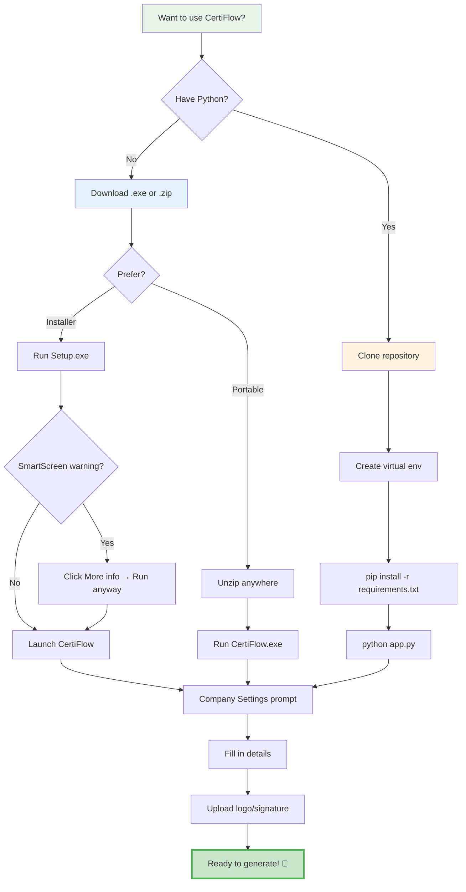
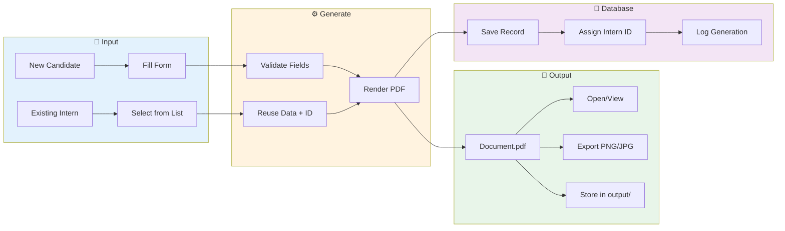
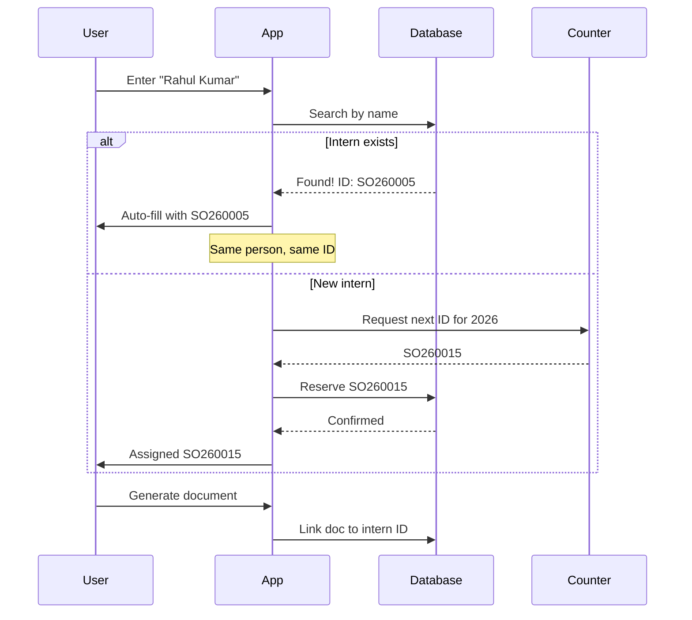
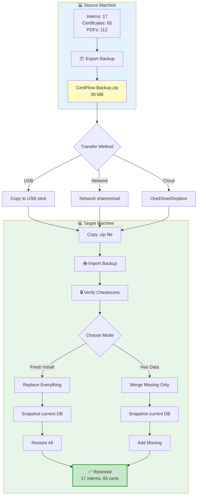
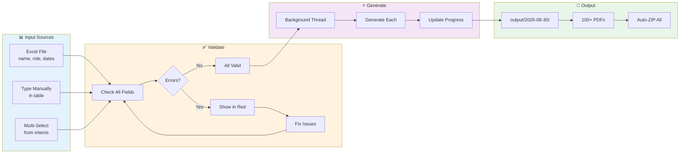
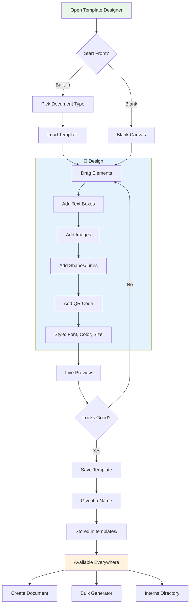
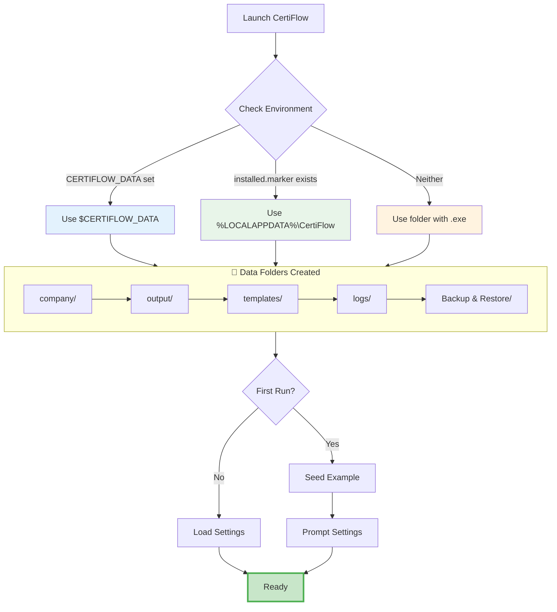
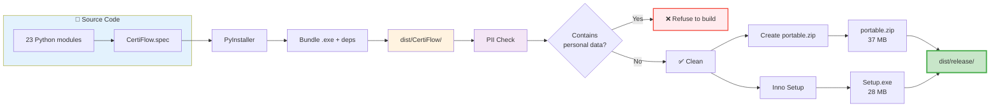
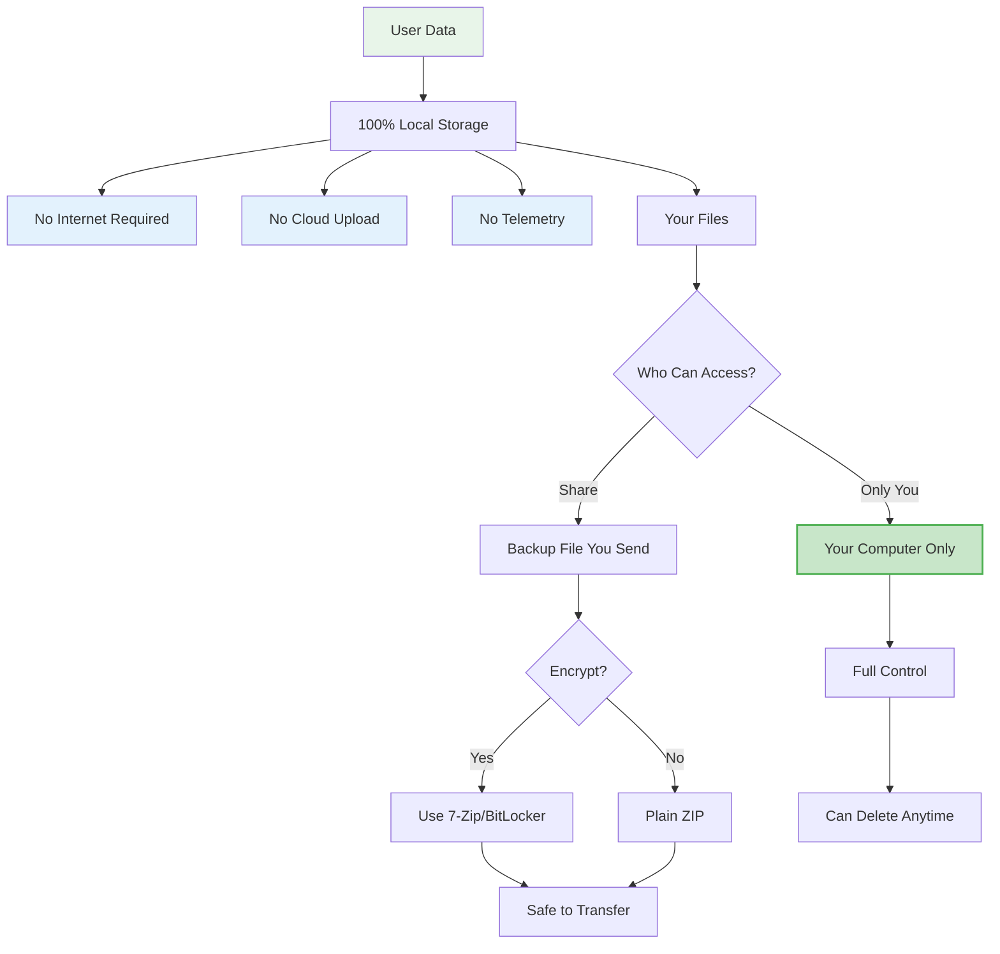

# CertiFlow Visual Guide

## 🎨 Complete Workflow with Diagrams

### 1️⃣ Installation Flow



---

### 2️⃣ Document Generation Workflow



---

### 3️⃣ Intern ID System



---

### 4️⃣ Backup & Restore Flow



---

### 5️⃣ Bulk Generation Pipeline



---

### 6️⃣ Template Designer Workflow



---

### 7️⃣ Data Location Logic



---

### 8️⃣ Build & Package Pipeline



---

## 📱 UI Screen Flow

### Navigation Structure

```
┌─────────────────────────────────────────────────────────────┐
│  CertiFlow                                           ☀/🌙   │
│  ScaleOn                                                    │
│ ───────────────────────────────────────────────────────── │
│                                                             │
│  📄  Create Document   ◄─── Most used                      │
│  🎨  Template Designer                                      │
│  👥  Interns           ◄─── View all records               │
│  ⚡  Bulk Generator    ◄─── Process many at once           │
│  🔎  Verification      ◄─── Look up by ID                  │
│  📁  Generated Files   ◄─── Open past documents            │
│  💾  Backup & Restore  ◄─── Migrate/archive                │
│  🏢  Company Settings  ◄─── One-time setup                 │
│  ℹ   About                                                  │
│                                                             │
│  Keyboard: Ctrl+1 through Ctrl+9 to switch pages           │
└─────────────────────────────────────────────────────────────┘
```

---

## 🎯 Common User Journeys

### Journey 1: First-Time User
```
1. Download & Install
   └─> Company Settings
       └─> Upload branding
           └─> Create first document
               └─> View in Generated Files
```

### Journey 2: Bulk Generation
```
1. Prepare Excel with candidate list
   └─> Bulk Generator → Import
       └─> Fix any validation errors
           └─> Generate All (background)
               └─> Download auto-created ZIP
```

### Journey 3: Migrating to New Computer
```
1. Old Computer: Backup & Restore → Export
   └─> Copy .zip to new computer
       └─> New Computer: Import Backup
           └─> Choose Merge or Replace
               └─> All data restored with same IDs
```

### Journey 4: Creating Custom Design
```
1. Template Designer
   └─> Start from existing or blank
       └─> Drag text/images/shapes
           └─> Style everything
               └─> Save with name
                   └─> Now available in Create Document
```

### Journey 5: Looking Up an Issued Certificate
```
1. Verification page
   └─> Enter Intern ID (e.g., SO260008)
       └─> See full details + all certificates
           └─> Open PDF button → view document
```

---

## 🔒 Security & Privacy



---

## 📊 System Architecture Layers

```
┌───────────────────────────────────────────────────────────┐
│                    🖥️ User Interface                      │
│   CustomTkinter · Dark/Light Theme · Live Previews       │
└───────────────────────────────────────────────────────────┘
                           ↓
┌───────────────────────────────────────────────────────────┐
│                 🎯 Business Logic Layer                   │
│   Validation · ID Generation · Batch Processing           │
│   Import/Export · Backup/Restore · Template Engine        │
└───────────────────────────────────────────────────────────┘
                           ↓
┌───────────────────────────────────────────────────────────┐
│                  📄 Document Generation                    │
│   ReportLab (PDF) · Pillow (Images) · Fonts Embedded     │
│   pypdfium2 (Preview) · Custom Renderers                 │
└───────────────────────────────────────────────────────────┘
                           ↓
┌───────────────────────────────────────────────────────────┐
│                   💾 Data Persistence                     │
│   SQLite (IDs) · JSON (Settings) · File System (PDFs)    │
│   Snapshots (Backup) · Archives (Transfer)               │
└───────────────────────────────────────────────────────────┘
```

---

<div align="center">

## 🎉 Visual Guide Complete!

This guide covers all major workflows, diagrams, and user journeys.

**For more details, see:**
- [README.md](README.md) - Full documentation
- [docs/SETUP.md](docs/SETUP.md) - Build guide
- [GitHub Repository](https://github.com/amangovindrao/CertiFlow)

</div>
