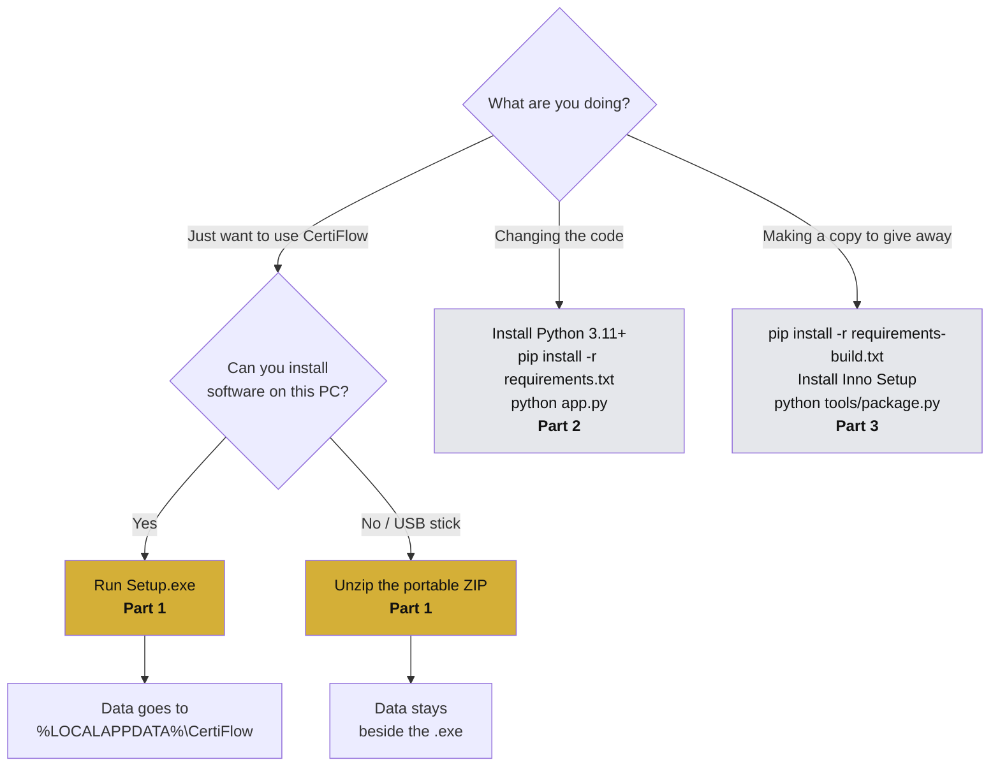
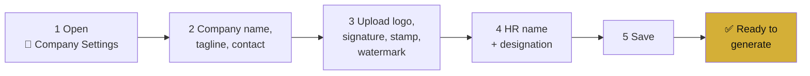
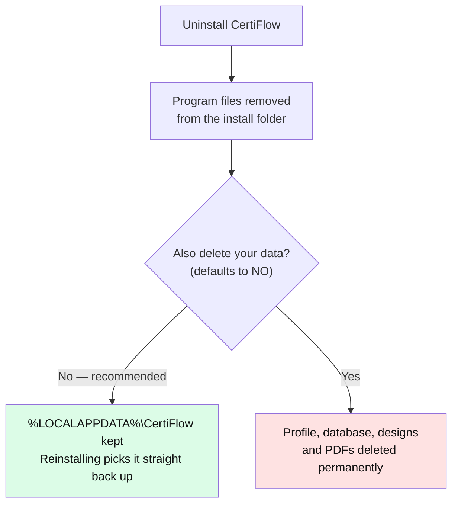
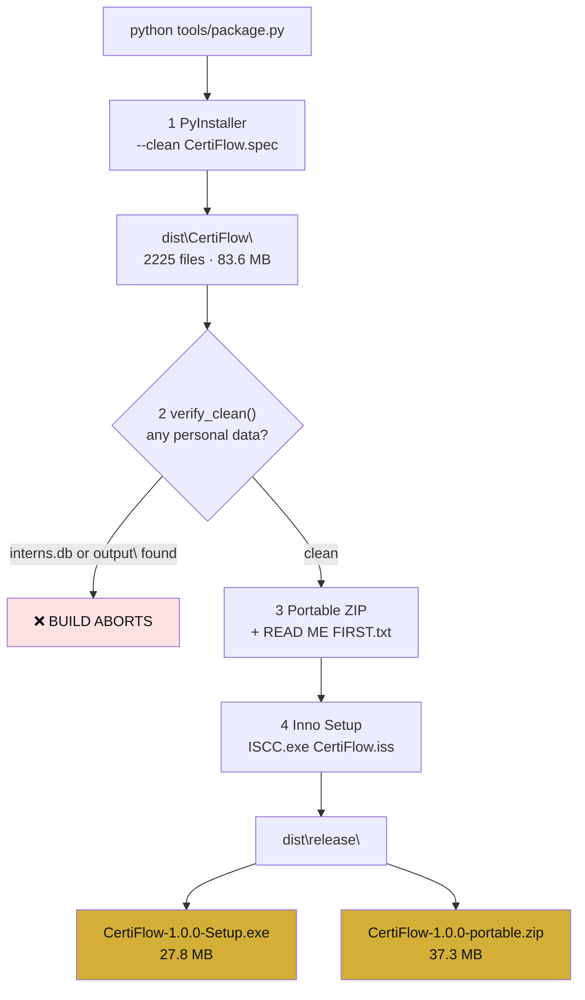
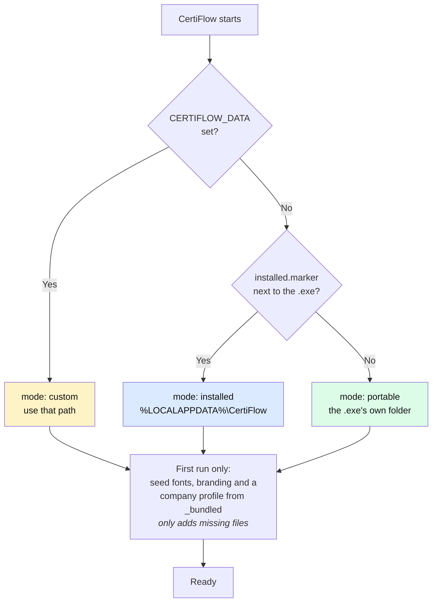
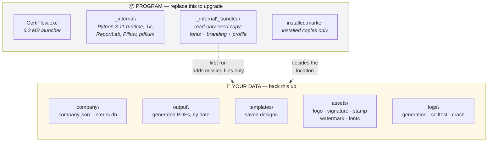
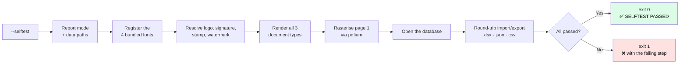
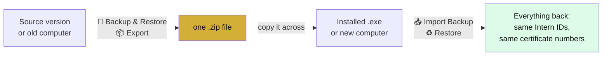
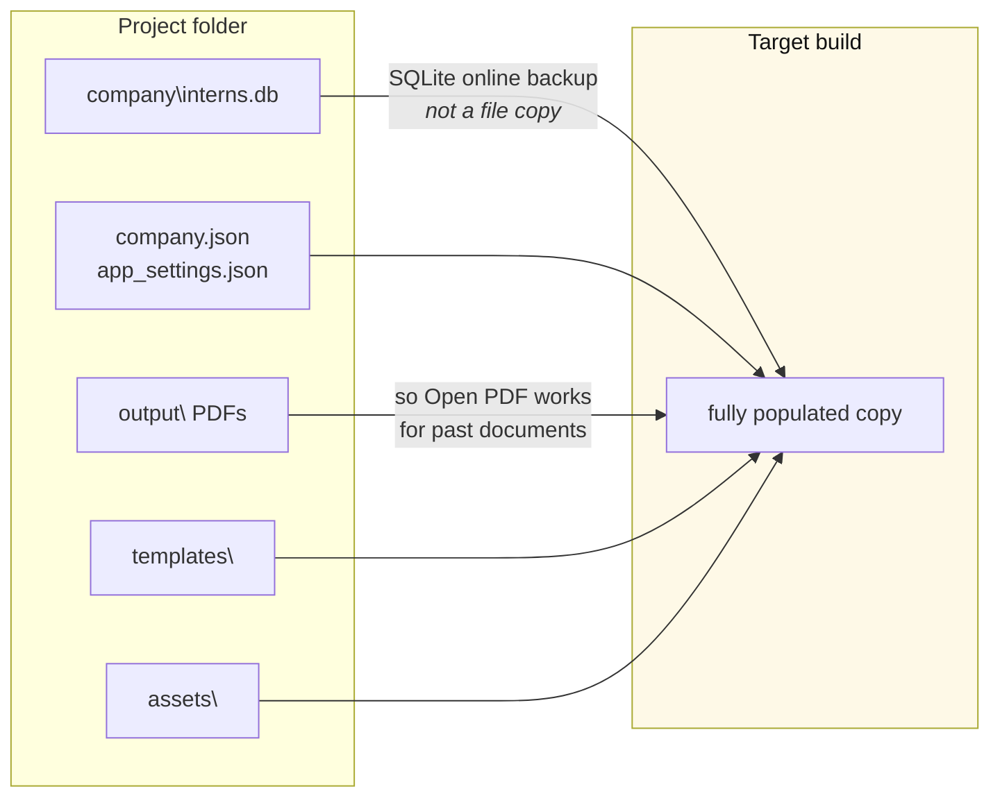

<div align="center">


# CertiFlow — Setup, Build &amp; Distribution Guide

**Install it · run it from source · build the installer · understand why it works that way**

</div>

---

## Contents

- [What you get](#what-you-get)
- [Which path do you need?](#which-path-do-you-need)
- [Part 1 — Installing CertiFlow](#part-1--installing-certiflow)
- [Part 2 — Running from source](#part-2--running-from-source)
- [Part 3 — Building the distributables](#part-3--building-the-distributables)
- [Part 4 — Where your data lives, and why](#part-4--where-your-data-lives-and-why)
- [Part 5 — Anatomy of a build](#part-5--anatomy-of-a-build)
- [Part 6 — Verifying a build](#part-6--verifying-a-build)
- [Part 7 — Moving your data into a build](#part-7--moving-your-data-into-a-build)
- [Part 8 — Troubleshooting](#part-8--troubleshooting)
- [Command reference](#command-reference)
- [Release checklist](#release-checklist)

---

## What you get

`python tools/package.py` produces two artefacts in `dist\release\`. Both are safe to hand to another person: **neither contains any intern records.**

| Artefact | Size | Admin needed | Best for |
|---|---|---|---|
| `CertiFlow-1.0.0-Setup.exe` | ~28 MB | **No** | Normal use. Start Menu entry, optional desktop icon, listed in Apps &amp; Features, clean uninstaller. |
| `CertiFlow-1.0.0-portable.zip` | ~37 MB | **No** | USB sticks, locked-down PCs, trying it without installing. Everything stays in the folder. |

Neither needs Python, ReportLab, or anything else installed on the target machine. The Python runtime is inside the build.

---

## Which path do you need?



---

## Part 1 — Installing CertiFlow

### Option A: the installer (recommended)

**Step 1.** Double-click `CertiFlow-1.0.0-Setup.exe`.

**Step 2.** Windows will show a blue **"Windows protected your PC"** screen. This is expected.

> Click **More info** → **Run anyway**.
>
> **Why this happens:** Windows SmartScreen warns about any program whose publisher it cannot verify. Verification requires a paid code-signing certificate, which this build does not have. The warning is about the *absence of a signature*, not about anything detected in the file. If you are handing this to colleagues, warn them in advance — otherwise many people will assume it is malware and stop.

**Step 3.** Accept the licence (MIT), then choose the install location. The default is per-user and needs no administrator password.

**Step 4.** Tick **Create a desktop icon** if you want one, then **Install**.

**Step 5.** Leave **Launch CertiFlow** ticked and click **Finish**.

That is it. CertiFlow appears in the Start Menu and in **Settings → Apps → Installed apps**.

<details>
<summary><b>Installing silently (for IT / scripted rollout)</b></summary>

```powershell
# Per-user, no prompts, no admin required
CertiFlow-1.0.0-Setup.exe /VERYSILENT /SUPPRESSMSGBOXES /NORESTART /CURRENTUSER

# Machine-wide for all users (requires an elevated prompt)
CertiFlow-1.0.0-Setup.exe /VERYSILENT /SUPPRESSMSGBOXES /NORESTART /ALLUSERS

# Custom location, and skip the shortcuts
CertiFlow-1.0.0-Setup.exe /VERYSILENT /DIR="D:\Apps\CertiFlow" /NOICONS
```

Exit code `0` means success. These are standard Inno Setup switches; `/?` lists them all.
</details>

### Option B: the portable ZIP

**Step 1.** Unzip `CertiFlow-1.0.0-portable.zip` to a folder **you can write to** — Documents, Desktop, or a USB stick.

> **Not** `C:\Program Files`. A portable copy stores its records beside the .exe, and Program Files is read-only for normal users, so it would fail to save anything.

**Step 2.** Run `CertiFlow.exe`. There is a `READ ME FIRST.txt` in the folder covering the same ground.

**Step 3.** To move it later, copy the whole folder. Your records travel with it.

### First run — do this before generating anything



Every document is rendered from that profile. Nothing else needs configuring — no fonts to install, no paths to set.

### Finding your data

Open the **ℹ About** page. It shows which mode this copy is in and the exact data folder, with **📂 Open Data Folder** and a copy button.

**That folder is your backup.** Copy it and you have everything: company profile, intern database, saved designs and every generated PDF.

### Uninstalling

**Settings → Apps → Installed apps → CertiFlow → Uninstall**, or the Start Menu shortcut.

The uninstaller asks whether to delete your data as well, and **defaults to No**:



**Why default to keeping it:** certificate records are the one thing here that cannot be recreated. A certificate number that no longer verifies is a real problem for whoever holds the printed document, so an accidental uninstall must not be able to cause that.

---

## Part 2 — Running from source

For editing the code.

### Prerequisites

| Requirement | Version | Notes |
|---|---|---|
| Windows | 10 or 11, 64-bit | The app is Windows-only in practice: it uses Windows paths, shell integration and Tk theming. |
| Python | **3.11+** | 3.11.8 is what this was developed and tested against. |

### Steps

```powershell
# 1. Get the code
git clone https://github.com/amangovindrao/CertiFlow.git
cd CertiFlow

# 2. Create a virtual environment (recommended, keeps your global Python clean)
python -m venv .venv
.venv\Scripts\activate

# 3. Install the runtime dependencies
pip install -r requirements.txt

# 4. Run
python app.py
```

Running from source, data lives in the project folder itself (`company\`, `output\`, `templates\`, `logs\`) — mode `source` on the About page.

### The dependencies, and what breaks without each

| Package | Used for | If missing |
|---|---|---|
| `customtkinter` | The entire UI | App will not start |
| `reportlab` | PDF generation | App will not start |
| `Pillow` | Image handling, icon generation | App will not start |
| `tkcalendar` | Date pickers | Date fields fall back to typing |
| `openpyxl` | Excel import/export | `.xlsx` unavailable; CSV and JSON still work |
| `pypdfium2` | Live preview, PNG/JPG export | PDFs still generate; preview and image export disabled |

`tkinterdnd2` is optional and **not installed by default**. With it, you can drag image files onto the asset pickers in Company Settings; without it, the Browse button does the same job.

---

## Part 3 — Building the distributables

### Toolchain

```powershell
# Build-time Python packages (PyInstaller, pinned)
pip install -r requirements-build.txt
```

Plus **[Inno Setup 6](https://jrsoftware.org/isdl.php)**, which turns the build folder into `Setup.exe`. It installs per-user without administrator rights:

```powershell
# Download innosetup-6.7.3.exe from the link above, then:
.\innosetup-6.7.3.exe /VERYSILENT /CURRENTUSER
```

> The download button on jrsoftware.org points at GitHub Releases; a direct `wget` of `download.php/is.exe` fetches the HTML page, not the installer.

`package.py` finds `ISCC.exe` automatically in `%LOCALAPPDATA%\Programs\InnoSetup6`, in Program Files, or on `PATH`. Without it, the build still produces the portable ZIP and tells you the installer was skipped.

### One command

```powershell
python tools/package.py
```

### What that actually does



**Stage 1 — PyInstaller** freezes the app into a folder: your code, the Python 3.11 runtime, Tk, ReportLab, Pillow, openpyxl and the pdfium binary. `--clean` wipes previous output so no stale file survives into a release.

**Stage 2 — the personal-data guard.** This is the stage that makes the artefacts *shareable*, and it is the reason `package.py` exists rather than a bare PyInstaller call. It walks the build and aborts if it finds `interns.db`, its WAL sidecars, or anything under `output\` or `backups\`.

> **Why it is necessary:** `deploy_data.py` deliberately copies your real records *into* `dist\CertiFlow` so you can use the build yourself. That leaves a folder which looks identical to a clean one but contains every intern's personal data and 65 real certificates. Without an automated check, the only thing standing between that folder and a colleague's inbox is memory. Verified working: run against a deployed folder it caught **117 files** and refused to continue.

**Stage 3 — the portable ZIP** packs the folder under a top-level `CertiFlow\` directory (so it cannot explode over someone's Desktop) and adds `READ ME FIRST.txt`. It deliberately does **not** include `installed.marker`, which is what keeps it portable.

**Stage 4 — Inno Setup** compiles `installer\CertiFlow.iss` into a single setup executable: LZMA2-compressed payload, the app icon, shortcuts, registry entries for Apps &amp; Features, an uninstaller, and `installed.marker`.

### Useful variations

```powershell
python tools/package.py --skip-build      # reuse dist\CertiFlow as-is (still verified)
python tools/package.py --no-installer    # portable ZIP only
python tools/package.py --no-zip          # installer only

# Plain folder build, no packaging — this is a portable copy
python -m PyInstaller --noconfirm --clean CertiFlow.spec
```

### Version numbers

One place: `settings.APP_VERSION`. The About page, the exe's Properties, the installer, the Apps &amp; Features entry and both artefact filenames all read from it. Bump it there and rebuild.

---

## Part 4 — Where your data lives, and why

The single most important design decision in the packaging, and the one that took real work.

### The problem

The app originally kept data next to the .exe:

```python
BASE_DIR = Path(sys.executable).parent      # data beside the program
```

That is ideal for a folder you copy around. It **breaks completely** once the app is installed to `C:\Program Files\CertiFlow`, because that folder is read-only for standard users. The company profile, the database and every generated PDF would fail to save.

Worse, on a machine where it *did* succeed (an administrator account), two Windows users would silently share one intern database.

### The solution



| Mode | Data folder | When |
|---|---|---|
| `installed` | `%LOCALAPPDATA%\CertiFlow` | Installed via Setup.exe |
| `portable` | beside `CertiFlow.exe` | Portable ZIP, or a plain PyInstaller folder |
| `source` | the project folder | `python app.py` |
| `custom` | `%CERTIFLOW_DATA%` | Env var set — shared network folder, or testing |

### Why the marker is on the *installer*, not the portable build

The switch is one file, `installed.marker`, placed by the installer. It could have gone the other way — a `portable.marker` in the ZIP — but that would mean a plain `python -m PyInstaller CertiFlow.spec` folder suddenly wrote to AppData, changing long-standing behaviour and breaking `deploy_data.py`. Declaring *installed* keeps the default (portable) exactly as it always was.

There is also a hard technical reason it cannot be automatic: PyInstaller 6 places bundled data files under `_internal\`, not beside the .exe, so a marker shipped as build data could never appear in the folder the check looks at. The installer has to place it.

### Why not just test whether the folder is writable?

Because the answer depends on *who is running the app*. An administrator can write to Program Files; a standard user cannot. The same installation would then use two different data folders depending on the account, which is worse than either choice consistently.

### Why `%LOCALAPPDATA%` and not Documents?

- Always writable, no elevation, no prompts.
- Private per Windows user — separate accounts get separate records.
- Not swept up by Documents backup tools or OneDrive sync, which would try to sync a live SQLite database and can corrupt it.
- Survives upgrades: replacing the program folder never touches it.

Because the folder is not obvious, the **About page** shows the mode, the full path, and buttons to open or copy it.

---

## Part 5 — Anatomy of a build



### Seeding

On first run the app copies fonts, branding images and a starter `company.json` out of the read-only `_bundled` payload into your data folder. Seeding **only ever adds files that are missing**, so upgrading the program can never overwrite your logo or company profile.

That is also why the assets are real files in your data folder rather than staying inside the bundle: Company Settings lets you replace them, so they have to live somewhere writable.

### Why one folder rather than `--onefile`

A single-file PyInstaller exe unpacks its whole ~85 MB payload into a temp directory on **every launch**, which is slow, and puts the app's own working directory somewhere that is wiped on exit. The folder build starts immediately and keeps the native pdfium and Tk libraries at a stable path. The installer and ZIP then wrap that folder into one file to hand over — which is the part that actually matters for sharing.

---

## Part 6 — Verifying a build

Launching the app proves Tk loaded. It does not prove PDFs render, fonts resolved, or Excel export works. So every build carries a self-test:

```powershell
CertiFlow.exe --selftest
```



It writes a report to `logs\selftest.log` in the data folder and generates into a temp directory, so **it never touches your real records**. A healthy run:

```text
CertiFlow selftest  2026-08-30 16:52:44
  frozen        : True
  base dir      : C:\Users\You\AppData\Local\CertiFlow
  resource dir  : C:\Users\You\AppData\Local\Programs\CertiFlow\_internal
  fonts on disk : 4 ['IBMPlexSans-Bold.ttf', ...]
  fonts         : registered
  asset logo     : ok assets\logo\logo.png
  render        : Internship Offer -> 362 KB
  render        : Internship Certificate -> 419 KB
  render        : Completion Certificate -> 362 KB
  preview       : ok 1600x1132 px
  database      : ok, 0 record(s), next id SO260001
  import/export : .xlsx ok (1 intern, 1 cert)
SELFTEST PASSED
```

**What to look at:** `base dir` confirms the data-location logic picked the right mode. The three `render` lines with plausible sizes prove fonts and branding resolved — a build with broken fonts still renders, just much smaller and in Helvetica. `preview` failing means pdfium did not bundle. `import/export` failing means openpyxl did not bundle.

---

## Part 7 — Moving your data into a build

A fresh install starts empty **by design** — that is what makes it shareable. There are two ways to fill it in, and for almost everyone the first is the right one.

### Option A: the app's own Backup & Restore *(recommended)*

No command line, works on any machine, and works for moving between computers.



1. In the **source** version (or on the old computer), open **💾 Backup & Restore** → **📦 Export / Create Backup**.
2. Copy the resulting `.zip` from the `Backup & Restore` folder to the new machine — USB stick, email, network share, anything.
3. In the **installed** version, open **💾 Backup & Restore** → **📥 Import Backup**, pick the file, and confirm the restore.

On a fresh install it restores everything in one click. On a machine that already has records it offers **Merge** (adds only what is missing) or **Replace**. Either way the current database is snapshotted first, and the archive's SHA-256 checksums are verified before anything is written.

Verified with real data: a 39 MB export of **17 interns, 65 certificates and 112 PDFs** restored into a fresh install with identical Intern ID sets, identical certificate numbers, both ID counters intact, and all 65 stored PDF paths resolving.

### Option B: `deploy_data.py` (developer shortcut)

Copies straight from the project folder into a build, without going through an archive. Handy while developing; it needs Python and both folders on the same machine.

```powershell
python tools/deploy_data.py                                        # dist\CertiFlow
python tools/deploy_data.py "$env:LOCALAPPDATA\CertiFlow"          # an installed copy's data
python tools/deploy_data.py "D:\CertiFlow"                         # anywhere
```



Two details that matter:

**The database is copied with SQLite's online backup API, not `copy`.** Under WAL journalling, recent commits live in a separate `-wal` file; a plain file copy can silently lose them. The backup API produces one consistent file.

**`output\` is copied too.** Stored PDF paths are relative to the data folder, so without the PDFs the *Open PDF* buttons on historical records find nothing.

> ⚠️ After running this the target contains intern personal data. To share that folder afterwards, delete `company\interns.db` and `output\`, or just rebuild. **Re-run it after every rebuild** — `--clean` deletes `dist\CertiFlow` entirely.

### Which files hold your data

Both options move the same set. Anything not listed is either machine-local or regenerated automatically.

| Included | Why |
|---|---|
| `company\interns.db` | Interns, certificate records **and the ID counters** — without these, new IDs could collide with issued ones |
| `company\company.json` | Company profile: branding, HR block, footer |
| `company\app_settings.json` | Preferences (theme) |
| `templates\*.json` | Designs saved in the Template Designer |
| `assets\**` | Logo, signature, stamp, watermark, fonts |
| `output\**` | Generated PDFs, so *Open PDF* works on historical records |

| Excluded | Why |
|---|---|
| `logs\` | Machine-local noise, never worth restoring |
| `company\backups\` | Snapshots of the database that is already in the archive |
| `Backup & Restore\` | Including it would make each backup contain the previous one and grow without bound |
| `interns.db-wal` / `-shm` | Transient SQLite sidecars; the online backup API folds them in already |

---

## Part 8 — Troubleshooting

### The installer shows "Windows protected your PC"

Expected. **More info → Run anyway.** The build is unsigned; a code-signing certificate is the only real fix. Warn recipients in advance.

### The app was installed but nothing happens when I launch it

Check `%LOCALAPPDATA%\CertiFlow\logs\crash.log`. A windowed build cannot print a traceback, so startup failures are written there and shown in a dialog. For live output, build a console variant:

```powershell
$env:CERTIFLOW_CONSOLE=1
python -m PyInstaller --noconfirm CertiFlow.spec
.\dist\CertiFlow\CertiFlow.exe
Remove-Item Env:\CERTIFLOW_CONSOLE
```

Never ship the console variant.

### Build fails: `PermissionError: Access is denied: dist\CertiFlow`

A copy of CertiFlow is still running out of that folder, so `--clean` cannot delete it.

```powershell
Get-Process CertiFlow -ErrorAction SilentlyContinue | Stop-Process -Force
```

### Built exe dies instantly: `ImportError: The 'jaraco' package is required`

Caused by excluding `setuptools` in `CertiFlow.spec`. PyInstaller installs a `pkg_resources` runtime hook whenever that module is collected, and the hook needs setuptools' vendored packages. The spec excludes `babel.messages` instead — that is the gettext tooling which pulls setuptools in, and `tkcalendar` only needs `babel.dates` / `babel.numbers`. The comment in the spec explains this; do not "optimise" setuptools back into the exclude list.

### Build log shows `ERROR: Hidden import 'babel.messages.*' not found`

Harmless, and expected. Babel's own PyInstaller hook asks for modules the spec deliberately excludes. The build completes; check for `Build complete!`.

### `python tools/package.py` aborts with "files that must not be shared"

Working as intended — that build contains real records, almost certainly from `deploy_data.py`. Do a clean build:

```powershell
python -m PyInstaller --noconfirm --clean CertiFlow.spec
python tools/package.py --skip-build
```

### Installer step is skipped

`ISCC.exe` was not found. Install Inno Setup (see [Part 3](#part-3--building-the-distributables)). The portable ZIP is still produced.

### Edited `settings.py` but Python still sees the old values

Stale bytecode:

```powershell
Remove-Item __pycache__ -Recurse -Force
```

### Portable copy will not save anything

It was unzipped somewhere read-only, typically Program Files. Move it to Documents, the Desktop, or a USB stick — or use the installer instead.

### `.xlsx` import/export unavailable

`openpyxl` is missing. CSV and JSON still work. `pip install openpyxl`, or check the selftest's `import/export` lines in a packaged build.

### A restore says the backup failed its integrity check

The archive is corrupt or was edited — most often a copy that was interrupted, or a file that went through something which rewrote it. Nothing is applied; every file is checked against the SHA-256 in `manifest.json` *before* any writing starts. Re-copy the original and try again.

### "Not a CertiFlow Backup"

The `.zip` has no `manifest.json`, so it was not produced by **📦 Export / Create Backup**. A plain zip of your `company\` folder will not do — the manifest is what records the checksums and the record counts.

### Restore finished but my certificates are missing

Check whether the backup was made with **Include generated PDFs** unticked — the *records* restore either way, but the PDF files only travel when that box is ticked. The list on the Backup & Restore page shows "no PDFs" for a records-only archive.

### Merge did not bring back my company logo

Deliberate. Merge leaves an existing company profile alone rather than silently rebranding your documents, and tells you so in the summary. Use **Replace** if you want the backup's branding, or set it again in Company Settings.

### Where did my data go after upgrading?

Nowhere. It is in `%LOCALAPPDATA%\CertiFlow` (installed) or beside the .exe (portable). The About page shows the exact path with a button to open it.

---

## Command reference

| Task | Command |
|---|---|
| Run from source | `python app.py` |
| Verify anything | `CertiFlow.exe --selftest` / `python app.py --selftest` |
| Plain folder build | `python -m PyInstaller --noconfirm --clean CertiFlow.spec` |
| Build both artefacts | `python tools/package.py` |
| Package without rebuilding | `python tools/package.py --skip-build` |
| Portable ZIP only | `python tools/package.py --no-installer` |
| Move data between machines | In-app: **💾 Backup & Restore** → Export / Import |
| Fill a build with your data | `python tools/deploy_data.py [target]` |
| Regenerate the app icon | `python tools/build_icon.py` |
| Console build for debugging | `$env:CERTIFLOW_CONSOLE=1; python -m PyInstaller --noconfirm CertiFlow.spec` |
| Silent install | `CertiFlow-1.0.0-Setup.exe /VERYSILENT /CURRENTUSER` |
| Point at a custom data folder | `$env:CERTIFLOW_DATA="D:\CertiFlowData"` |

### Files involved in packaging

| File | Role |
|---|---|
| `CertiFlow.spec` | PyInstaller recipe: hidden imports, bundled payload, icon, windowed/console switch |
| `package.py` | Orchestrates build → personal-data check → ZIP → installer |
| `installer\CertiFlow.iss` | Inno Setup script: install layout, shortcuts, uninstaller, data prompt |
| `installer\installed.marker` | Placed by the installer; switches the app to `%LOCALAPPDATA%` |
| `deploy_data.py` | Copies live data into a built folder |
| `build_icon.py` | Generates `assets\app.ico` from the square ScaleOn mark |
| `requirements-build.txt` | Pinned PyInstaller |

---

## Release checklist

1. Bump `APP_VERSION` in `settings.py`.
2. `python app.py --selftest` — source is healthy.
3. Stop any running CertiFlow (`--clean` fails otherwise).
4. `python tools/package.py` — must report **no personal data**.
5. `dist\CertiFlow\CertiFlow.exe --selftest` — the frozen build is healthy.
6. Install the Setup.exe on a clean profile; confirm the About page shows mode **installed** and a path under `%LOCALAPPDATA%`.
7. Uninstall; confirm the program folder empties and your data is kept.
8. Unzip the portable ZIP elsewhere; confirm About shows mode **portable**.
9. Ship `dist\release\` — and tell recipients about the SmartScreen warning.

---

<div align="center">

**CertiFlow** · [README](../README.md) · Released under the [MIT Licence](../LICENSE)

</div>
